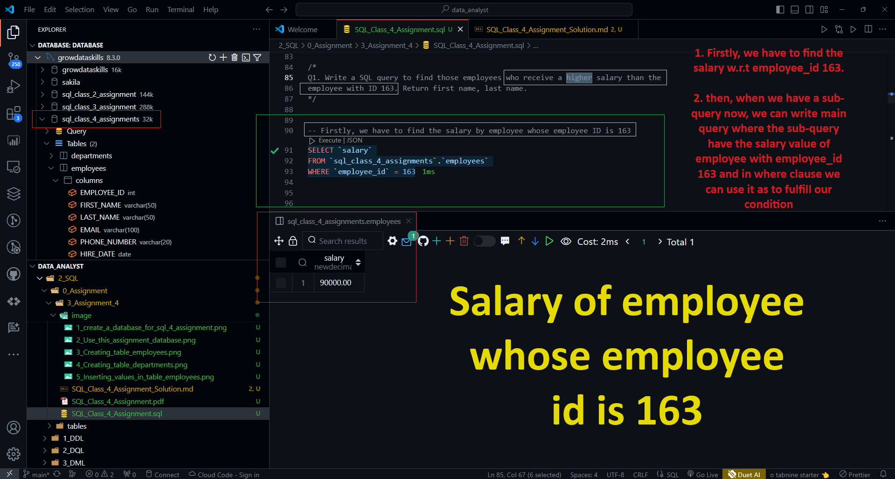

# Assignment

Create table and add dummy data for below questions:

**Execution Code :**

```sql
-- Creating a Database for sql_class_4_assignments
CREATE DATABASE sql_class_4_assignments;
```

**Output :**


**Execution Code :**

```sql
-- Using this specific DATABASE sql_class_4_assignments
USE sql_class_4_assignments;
```

**Output :**


**Employees**:

Columns: EMPLOYEE_ID, FIRST_NAME, LAST_NAME, EMAIL,
PHONE_NUMBER, HIRE_DATE, JOB_ID, SALARY, COMMISSION_PCT,
MANAGER_ID, DEPARTMENT_ID

**Execute Code :**

```sql
-- Creating tables `Employees` table 
CREATE TABLE Employees (
    EMPLOYEE_ID INT,
    FIRST_NAME VARCHAR(50),
    LAST_NAME VARCHAR(50),
    EMAIL VARCHAR(100),
    PHONE_NUMBER VARCHAR(20),
    HIRE_DATE DATE,
    JOB_ID VARCHAR(20),
    SALARY DECIMAL(10, 2),
    COMMISSION_PCT DECIMAL(10, 2),
    MANAGER_ID INT,
    DEPARTMENT_ID INT
);
```

**Output :**


**Departments:**

Columns: DEPARTMENT_ID, DEPARTMENT_NAME, MANAGER_ID, LOCATION_ID

**Execution Code :**

```sql
-- Creating Departments table
CREATE TABLE Departments (
    DEPARTMENT_ID INT,
    DEPARTMENT_NAME VARCHAR(50),
    MANAGER_ID INT,
    LOCATION_ID INT
);
```

**Output :**


**Inserting random values in employees table**

**Execution Code :**

```sql
-- Inserting dummy data in Employees table

INSERT INTO Employees (EMPLOYEE_ID, FIRST_NAME, LAST_NAME, EMAIL, PHONE_NUMBER, HIRE_DATE, JOB_ID, SALARY, COMMISSION_PCT, MANAGER_ID, DEPARTMENT_ID)
VALUES
(160, 'Arpit', 'Dubey', 'aarpitdubey@gmail.com', '825-199-9952', '2024-09-16', 'Artificial Intelligence Engineer', 200000.0, 0.20, NULL, 1),
(161, 'Shailja', 'Mishra', 'sara.johnson@gmail.com', '735-489-2736', '2024-10-05', 'Data Analyst', 55000.00, 0.10, 160, 2),
(162, 'Adam', 'Smith', 'ad.smith@gmail.com', '622-987-5312', '2024-10-15', 'Software Developer', 75000.00, 0.15, 161, 3),
(163, 'Rachel', 'Miller', 'rachel.miller@gmail.com', '830-348-9532', '2024-11-01', 'Product Manager', 90000.00, 0.18, 160, 5),
(164, 'Jack', 'Wilson', 'jack.wilson@gmail.com', '911-652-2347', '2024-11-15', 'Database Administrator', 60000.00, 0.12, 160, 5),
(165, 'Eva', 'Garcia', 'eva.garcia@gmail.com', '723-745-8246', '2024-12-01', 'Sales Manager', 100000.00, 0.20, 160, 1),
(166, 'Daniel', 'Lee', 'daniel.lee@gmail.com', '621-983-7532', '2024-12-15', 'HR Manager', 85000.00, 0.16, 163, 3),
(167, 'Sophia', 'Brown', 'sophia.brown@gmail.com', '835-385-8332', '2025-01-01', 'Finance Analyst', 70000.00, 0.13, 165, 4),
(168, 'Oliver', 'Martinez', 'oliver.martinez@gmail.com', '733-490-2413', '2025-01-15', 'Systems Engineer', 80000.00, 0.17, 166, 6),
(169, 'Emily', 'Adams', 'emily.adams@gmail.com', '914-683-1245', '2025-02-01', 'Marketing Coordinator', 65000.00, 0.14, 167, 2),
(170, 'Aiden', 'Thompson', 'aiden.thompson@gmail.com', '722-984-2411', '2025-02-15', 'Customer Service Representative', 45000.00, 0.10, 161, 7),
(171, 'Ava', 'Young', 'ava.young@gmail.com', '830-285-9384', '2025-03-01', 'Quality Assurance Manager', 95000.00, 0.20, 168, 9),
(172, 'Noah', 'Hernandez', 'noah.hernandez@gmail.com', '712-349-2512', '2025-03-15', 'Business Analyst', 65000.00, 0.14, 161, 11),
(173, 'Mia', 'Perez', 'mia.perez@gmail.com', '934-982-8921', '2025-04-01', 'Training Coordinator', 58000.00, 0.12, 169, 19),
(174, 'James', 'Lopez', 'james.lopez@gmail.com', '825-385-3249', '2025-04-15', 'Logistics Coordinator', 60000.00, 0.12, 168, 16),
(175, 'Charlotte', 'Gomez', 'charlotte.gomez@gmail.com', '722-349-8501', '2025-05-01', 'HR Coordinator', 55000.00, 0.10, 166, 3),
(176, 'Logan', 'Flores', 'logan.flores@gmail.com', '923-285-5019', '2025-05-15', 'Accountant', 68000.00, 0.15, 167, 13),
(177, 'Isabella', 'Diaz', 'isabella.diaz@gmail.com', '912-349-2810', '2025-06-01', 'Legal Counsel', 110000.00, 0.25, 170, 10),
(178, 'William', 'Rivera', 'william.rivera@gmail.com', '728-349-5503', '2025-06-01', 'Legal Advisor', 105000.00, 0.25, 170, 10),
(179, 'Grace', 'Perez', 'grace.perez@gmail.com', '912-349-2018', '2025-06-15', 'Operations Manager', 95000.00, 0.20, NULL, 11),
(180, 'Lucas', 'Nguyen', 'lucas.nguyen@gmail.com', '722-349-8321', '2025-07-01', 'Supply Chain Analyst', 70000.00, 0.15, 179, 18),
(181, 'Lily', 'Torres', 'lily.torres@gmail.com', '918-349-2045', '2025-07-15', 'Administration Coordinator', 55000.00, 0.10, 179, 17),
(182, 'Michael', 'Tran', 'michael.tran@gmail.com', '722-349-2020', '2025-08-01', 'Product Development Manager', 100000.00, 0.25, 178, 8),
(183, 'Zoe', 'Brooks', 'zoe.brooks@gmail.com', '911-349-2022', '2025-08-15', 'International Business Analyst', 75000.00, 0.18, 178, 28),
(184, 'Nicholas', 'Gutierrez', 'nicholas.gutierrez@gmail.com', '722-349-2050', '2025-09-01', 'Corporate Communication Manager', 85000.00, 0.20, 177, 26),
(185, 'Aria', 'Reyes', 'aria.reyes@gmail.com', '911-349-2044', '2025-09-15', 'Finance Manager', 110000.00, 0.30, 177, 4),
(186, 'Nathan', 'Long', 'nathan.long@gmail.com', '722-349-2001', '2025-10-01', 'Training Manager', 90000.00, 0.25, 177, 19),
(187, 'Hannah', 'Scott', 'hannah.scott@gmail.com', '911-356-2045', '2025-10-15', 'Investor Relations Manager', 100000.00, 0.28, 178, 30),
(188, 'Ethan', 'Flores', 'ethan.flores@gmail.com', '722-349-2450', '2025-11-01', 'Information Technology Manager', 105000.00, 0.30, 182, 5),
(189, 'Madeleine', 'Kim', 'madeleine.kim@gmail.com', '911-349-2099', '2025-11-15', 'Research and Development Manager', 95000.00, 0.25, 183, 6),
(190, 'Aaron', 'Chen', 'aaron.chen@gmail.com', '722-349-2091', '2025-12-01', 'Corporate Social Responsibility Manager', 90000.00, 0.20, 184, 29),
(191, 'Natalie', 'Liu', 'natalie.liu@gmail.com', '911-349-2098', '2025-12-15', 'Internal Audit Manager', 100000.00, 0.22, 185, 23),
(192, 'Charlotte', 'Wong', 'charlotte.wong@gmail.com', '722-349-2002', '2026-01-01', 'Business Development Manager', 110000.00, 0.25, 186, 24),
(193, 'David', 'Hu', 'david.hu@gmail.com', '911-349-2046', '2026-01-15', 'Strategic Planning Manager', 95000.00, 0.20, 186, 25),
(194, 'Clara', 'Wu', 'clara.wu@gmail.com', '722-349-2150', '2026-02-01', 'Public Relations Manager', 100000.00, 0.23, 187, 15);
```

**Output:**


### Q1. Write a SQL query to find those employees who receive a higher salary than the employee with ID 163. Return first name, last name

Firstly, we have to find the salary of employee whose `employee_id` is **163** i.e., **90,000**

```sql
-- Firstly, we have to find the salary by employee whose employee ID is 163
SELECT `salary` 
FROM `sql_class_4_assignments`.`employees` 
WHERE `employee_id` = 163
```

**output**



**Query :**

```sql
-- Now, we have to return the first name and, last name of employees whose salary are higher (or greator) 
-- than the salary by employee whose employee ID is 163

SELECT `first_name`, `last_name`
FROM `sql_class_4_assignments`.`employees`
WHERE `salary` > (SELECT `salary` 
FROM `sql_class_4_assignments`.`employees` 
WHERE `employee_id` = 163);
```

**Output :**


