# ASSIGNMENT - 3

## Patter Matching

### Question 1: How can you select all employees whose names start with the letter 'A'?

**Solution :** Here, we have to `SELECT` all the employees whose `FirstName` starts with the letter 'A' means we have to match the initial letter 'A' using the `WHERE` and `LIKE` we can find all the employees.

**Query :**
```SQL
SELECT *
FROM employees
WHERE FirstName LIKE 'A%';
```

**Execution :**


### Question 2: How do you find all products whose names contain the word 'phone' regardless of case?

Let's first look at the product table 

**Query :**
```SQL
-- Query to view the list of products
SELECT *
FROM `sql_class_3_assignment`.`products`;
```
**Execution :**


Now, We have to find only those products whose name contain 'phone'

**Query :**

```SQL
SELECT `ProductID`, `ProductName`, `Price`
FROM products
WHERE ProductName LIKE '%phone%';
```

**Execution :**


### Question 3: How can you retrieve all email addresses from a table that end with '.com'?

firstly, let's look at the employee table 

**Query :**
```SQL
SELECT *
FROM `sql_class_3_assignment`.`employee`;
```
**Execution :**


Here, we can see there are email addresses which contains '.com'

**Query :**

```SQL
SELECT `email`
FROM employee
WHERE email LIKE '%.com';
```
**Execution :**


### Question 4: How do you find all phone numbers that start with the area code '555'?

**Query :**

```SQL
SELECT *
FROM `sql_class_3_assignment`.`amazon`;
```

**Execution :**


To find out all the phone numbers that start with the area code '555' are

**Query :**

```SQL
SELECT `Phone Number`
FROM amazon
WHERE  `Phone Number` LIKE '555%';
```
**Execution :**


Here, the query working well, but have you noticed we didn't get those phone numbers whose are code were written inside the parenthesis. like `(555)`

**Query :**

```SQL
SELECT `Phone Number`
FROM amazon
WHERE `Phone Number` LIKE '555%' OR `Phone Number` LIKE '(555)%';
```
**Execution :**


### Question 5: How can you select all cities that start with 'New' followed by any characters?

**Query :**

```SQL
SELECT *
FROM `sql_class_3_assignment`.`phone_directory`;
```
**Execution :**


Now, let's filter all those cities at start with 'New' 

**Query :**

```SQL
SELECT `first_name`, `last_name`, `company_name`, `city`, `phone`
FROM `phone_directory`
WHERE `city` LIKE 'new%';
```
**Execution :**


### Question 6: How do you find all records where the value in the 'description' column contains either 'apple' or 'orange'?

Firstly, view the table

**Query :**
```SQL
SELECT *
FROM `sql_class_3_assignment`.`food_inventory`;
```
**Execution :**

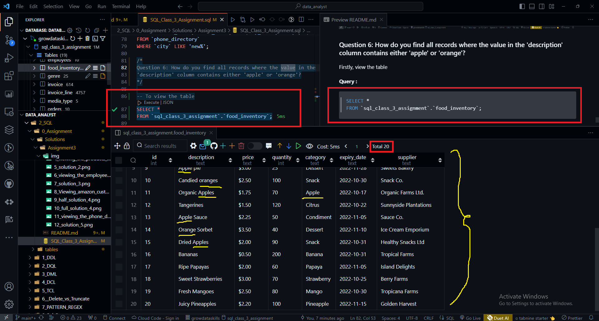

Records where the value in the 'description' column contains either 'apple' or 'orange'

**Query :**

```SQL
SELECT *
FROM `food_inventory`
WHERE `description` LIKE '%apple%' OR `description` LIKE '%orange%';
```
**Execution :**

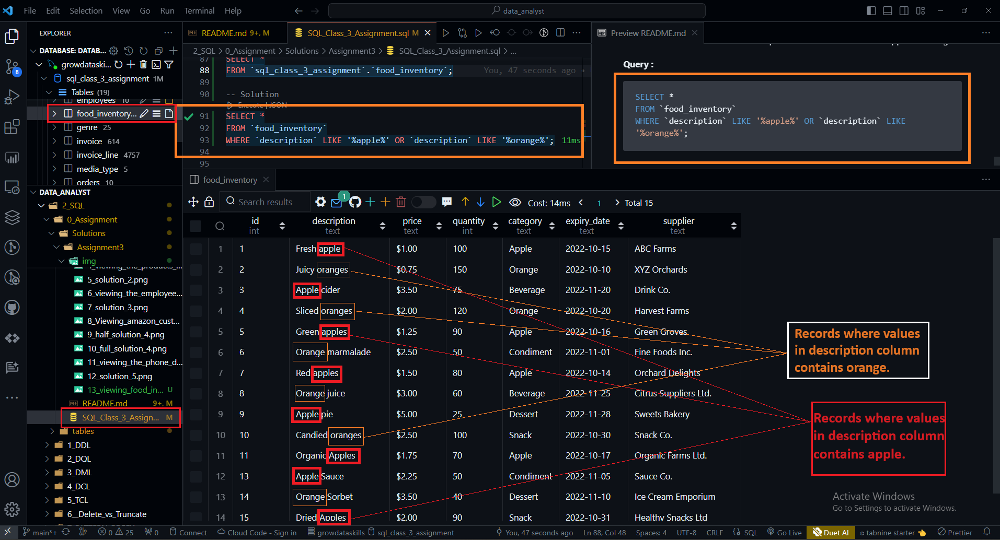

### Question 7:How can you retrieve all email addresses that follow the pattern of "user@domain.com"?

Let's take the `phone_directory` table and view it first.

**Query :**

```SQL
SELECT *
FROM `sql_class_3_assignment`.`phone_directory`;
```
**Execution :**

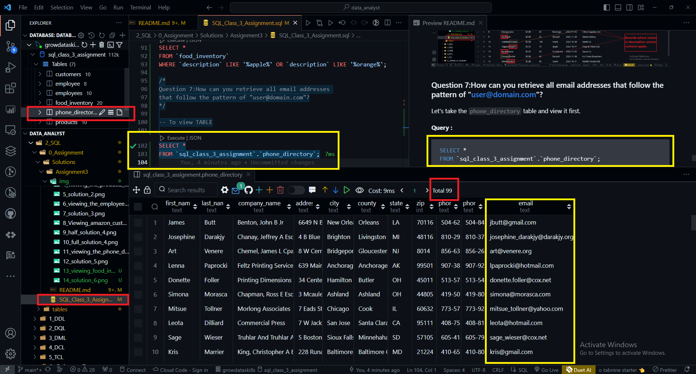

**Query :**

```SQL
SELECT `email`
FROM `phone_directory`
WHERE email LIKE '%@%.com'
```

**Execution :**

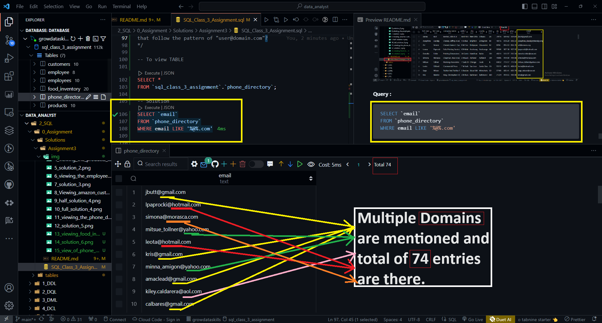

### Question 8: How do you find all records where the 'product_code' is exactly four characters long and consists of letters and digits?

Let's look the `product` table

**Query :**

```SQL
SELECT *
FROM `sql_class_3_assignment`.`product`;
```
**Execution :**

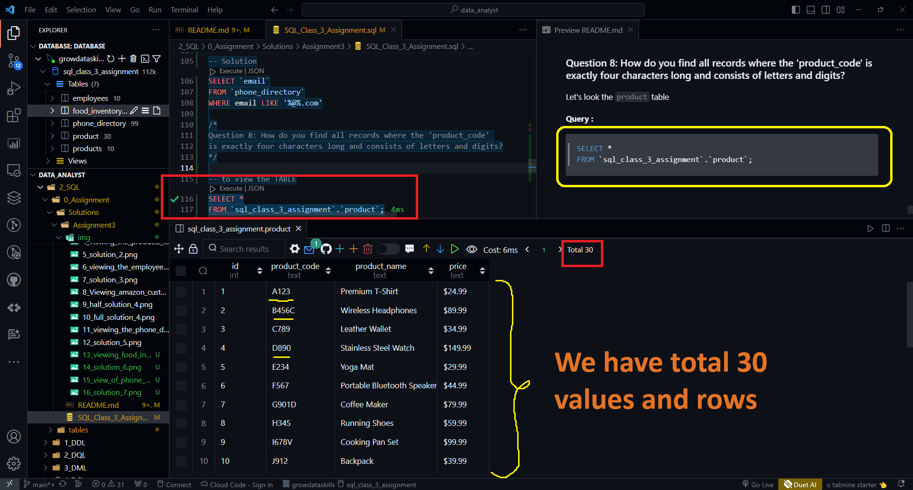

lets solve the problem using REGEXP 

**Query :**

```SQL
SELECT *
FROM `product`
WHERE `product_code` REGEXP '^[a-zA-Z0-9]{4}$'
```
**Execution :**

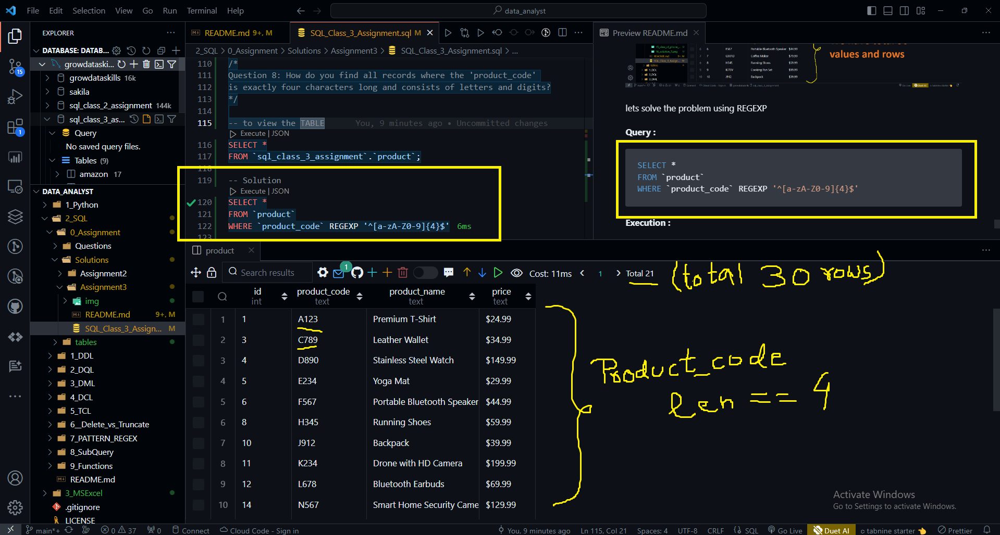
### Question 9: How can you retrieve all phone numbers that match the pattern '###-###-####'?

**Query :**

```SQL
SELECT *
FROM `sql_class_3_assignment`.`contacts`;
```
**Execution :**

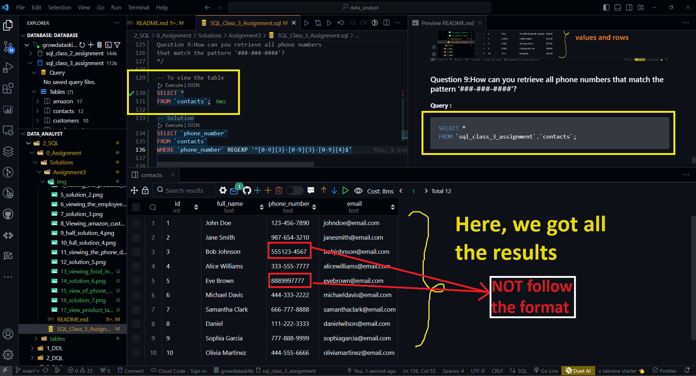

lets solve the problem using REGEXP

**Query :**

```SQL
SELECT `Phone_number`
FROM `contacts`
WHERE `Phone_number` REGEXP '^[0-9]{3}-[0-9]{3}-[0-9]{4}$';
```
**Execution :**

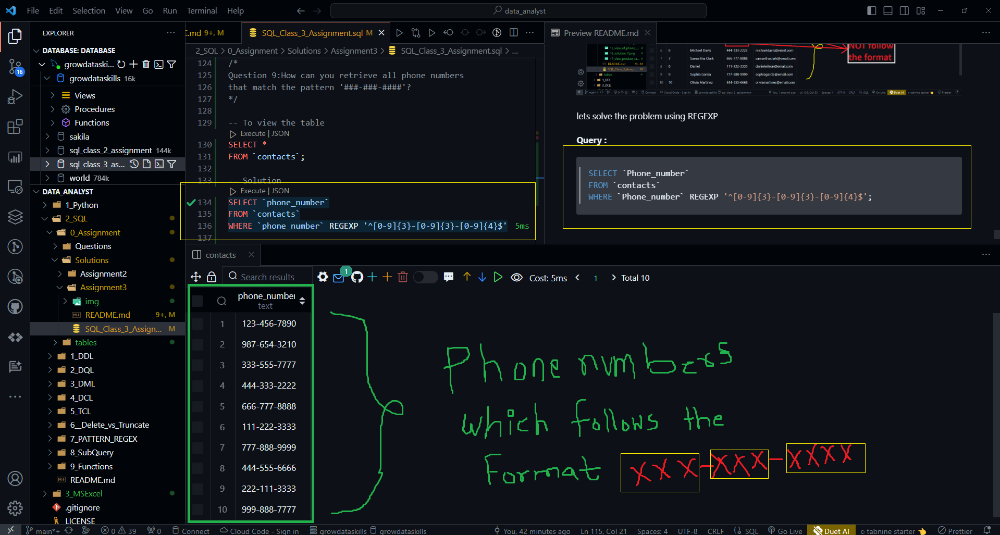

### Question 10: How do you find all records where the 'text' column contains two consecutive digits?

Let's first view the table `corpus`

**Query :**

```SQL
SELECT *
FROM `sql_class_3_assignment`.`corpus`;
```
**Execution :**

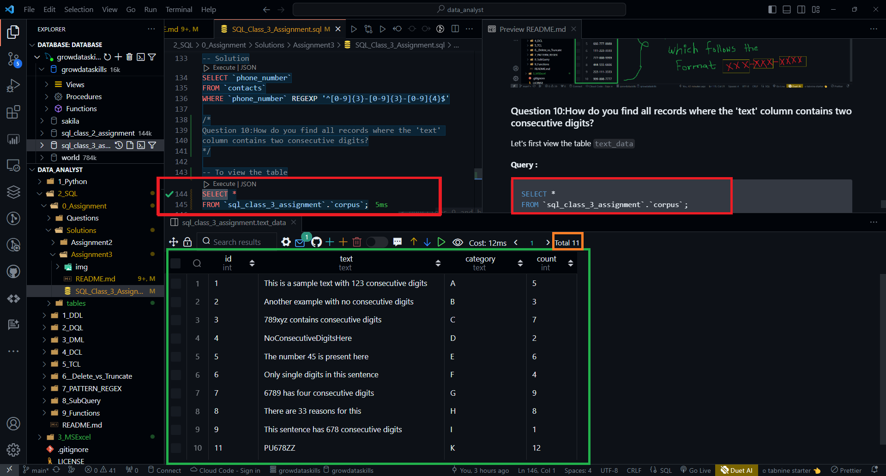

Now let's solve the Question here

**Query :**

```SQL
SELECT *
FROM `corpus`
WHERE `text` REGEXP '[0-9]{2}';
```
**Execution :**

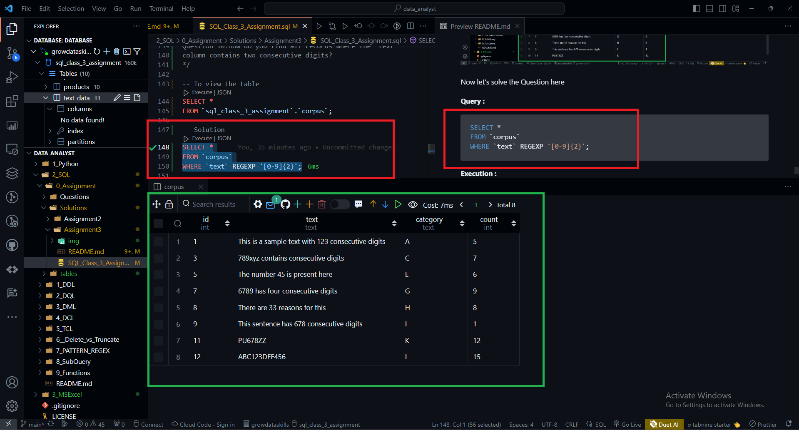

## NULL VALUES:

### Question 1: Find all employees whose birthdates are not recorded (NULL).

let's see the table

**Query :**

```SQL
SELECT *
FROM `sql_class_3_assignment`.`employees`;
```
**Execution :**

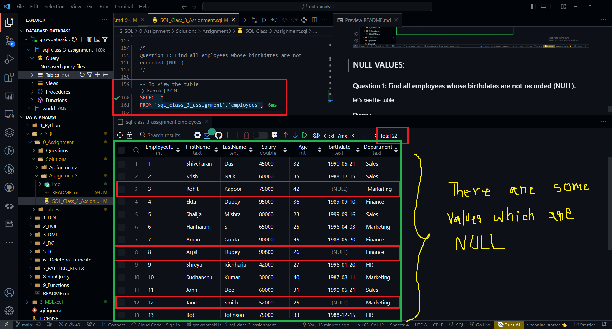

let's solve this problem

**Query :**

```SQL
SELECT *
FROM `employees`
WHERE `birthdate` IS NULL;
```

**Execution :**

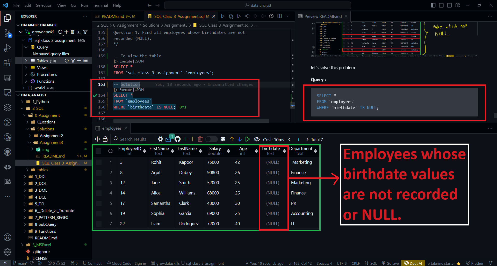

### Question 2: List all orders that don't have a customer assigned (NULL customerID).

let's see the table

**Query :**

```SQL
SELECT * 
FROM `sql_class_3_assignment`.`customers`;
```
**Execution :**

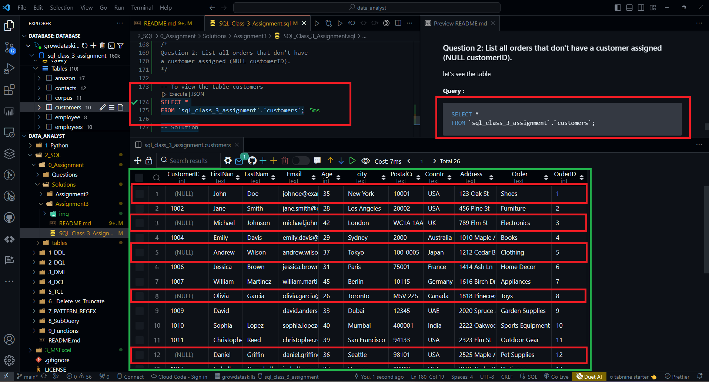
let's solve this problem

**Query :**

```SQL
SELECT `Order`, `OrderID`, `Country`
FROM `customers`
WHERE `CustomerID` IS NULL;
```
**Execution :**

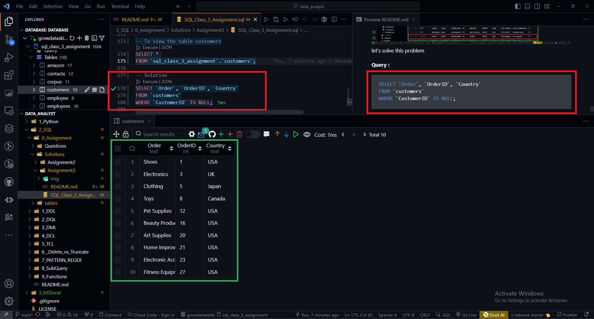

## FUNCTIONS:

- Consider a table named Sales with the following columns:

    **SaleID (integer):** The unique identifier for each sale.

    **Product (string):** The name of the product sold.

    **Quantity (integer):** The quantity of the product sold.

    **Price (decimal):** The price per unit of the product.

### Question 1: Find the total quantity sold for each product.

let's view `sales` table

**Query :**

```SQL
-- To view the table
SELECT *
FROM `sql_class_3_assignment`.`sales`;
```
**Execution :**

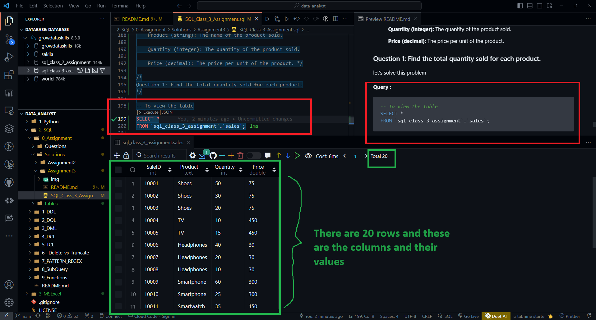

let's solve this problem

**Query :**

```SQL
-- Solution
SELECT `Product`, SUM(Quantity) AS `Total_Qty_Sold`
FROM `sql_class_3_assignment`.`sales`
GROUP BY `Product`;
```
**Execution :**


### Question 2: Calculate the total revenue generated from each product (Total Revenue = Quantity * Price).

**Query :**

```SQL
SELECT `Product`, `Price`, SUM(Quantity) AS 'Total Quantity Sold', SUM(Quantity * Price) AS `Total Revenue`
FROM `sql_class_3_assignment`.`sales`
GROUP BY `Product`, `Price`;
```
**Execution :**

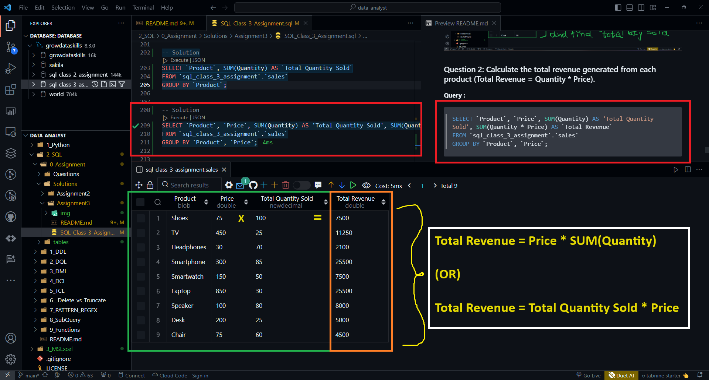

### Question 3: Determine the average price of each product.

**Query :**

```SQL
SELECT `Product`, AVG(`Price`) AS 'Average Price'
FROM `sql_class_3_assignment`.`sales`
GROUP BY `Price`;
```
**Execution :**

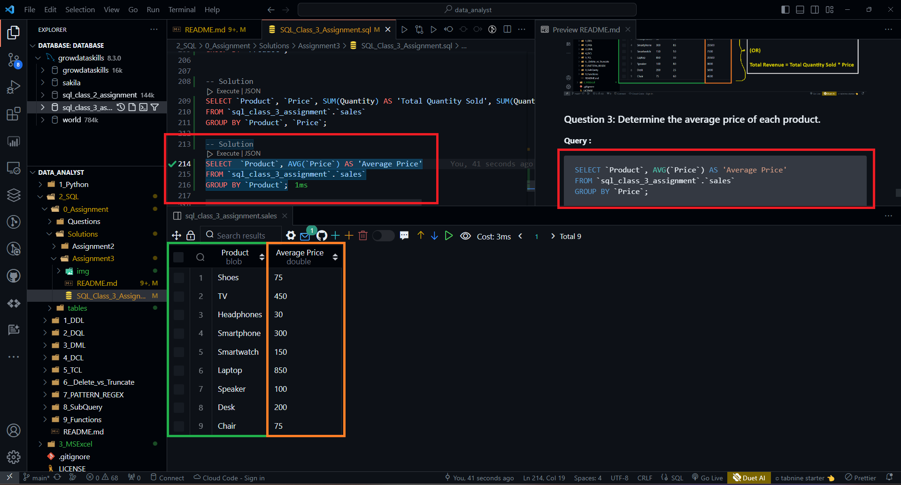

### Question 4: Find the product with the highest total revenue (Quantity * Price)

**Query :**

```SQL
SELECT `Product`, `Price`, SUM(`Quantity` * `Price`) AS `Total Quantity Sold`
FROM `sql_class_3_assignment`.`sales`
GROUP BY `Product`, `Price`
ORDER BY `Total Quantity Sold` DESC
LIMIT 1;
```

**Execution :**


### Question 5: Calculate the total quantity sold across all products.

**Query :**

```SQL
-- Solution
SELECT SUM(Quantity) AS OverAllQuantitySold
FROM `sql_class_3_assignment`.`sales`;
```
**Execution :**

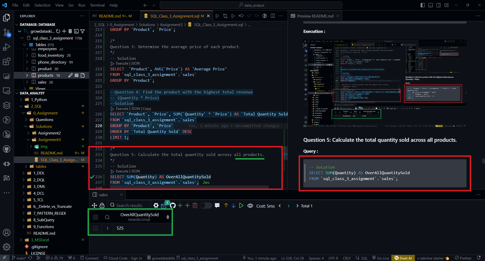
### Question 6: Determine the average price of all products.

**Query :**

```SQL
SELECT AVG(`Price`) AS `OverALLAveragePrice`
FROM `SQL_class_3_assignment`.`sales`;
```
**Execution :**

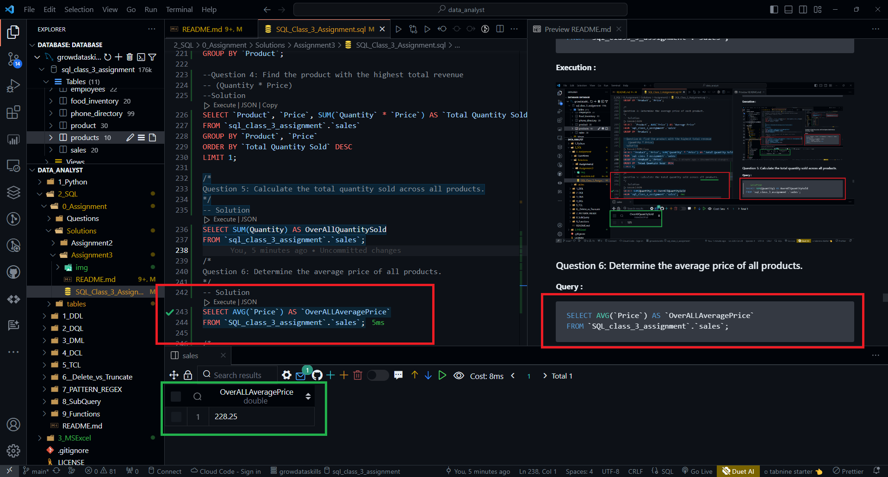
- Consider a table named Products with the following columns:

    **ProductID (integer):** The unique identifier for each product.

    **ProductName (string):** The name of the product.

    **Price (decimal):** The price of the product.

### Question 1: Determine the square root of the price for each product.

let's view `products` table

**Query :**

```SQL
-- To view the table
SELECT *
FROM `sql_class_3_assignment`.`products`;
```
**Execution :**

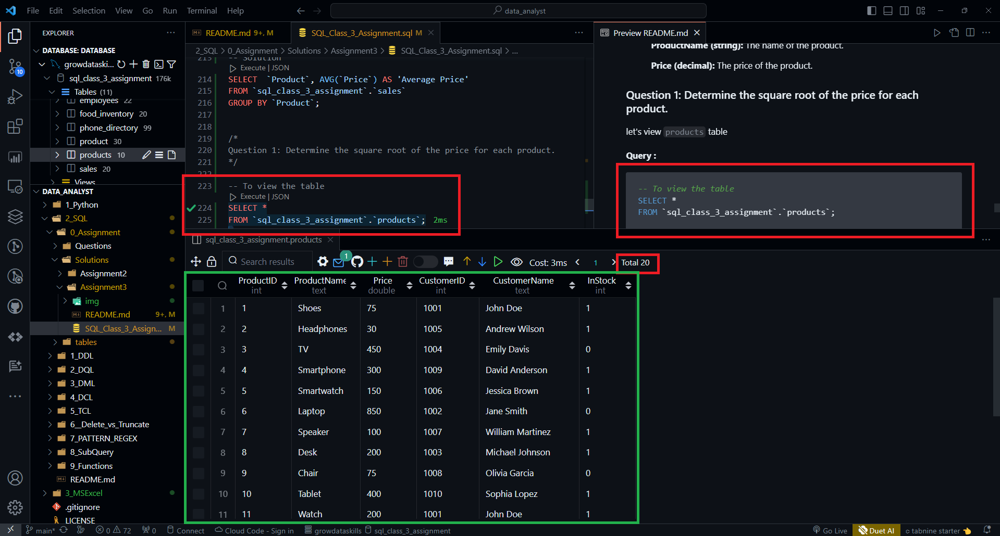

**Query :**

```SQL
-- Solution
SELECT `ProductName`, `Price`, SQRT(`Price`) AS `Square Root`
FROM `sql_class_3_assignment`.`products`
GROUP BY `ProductName`, `Price`;
```

**Execution :**


### Question 2: Find the ceiling (smallest integer greater than or equal to) of the prices.

**Query :**

```SQL

```

**Execution :**

### Question 3: Calculate the floor (largest integer less than or equal to) of the prices.

**Query :**

```SQL

```

**Execution :**

let's view `products` table

**Query :**

```SQL

```

**Execution :**

let's view `sales` table

**Query :**

**Execution :**

let's solve this problem

**Query :**

**Execution :**

let's view `sales` table

**Query :**

**Execution :**

let's solve this problem

**Query :**

**Execution :**