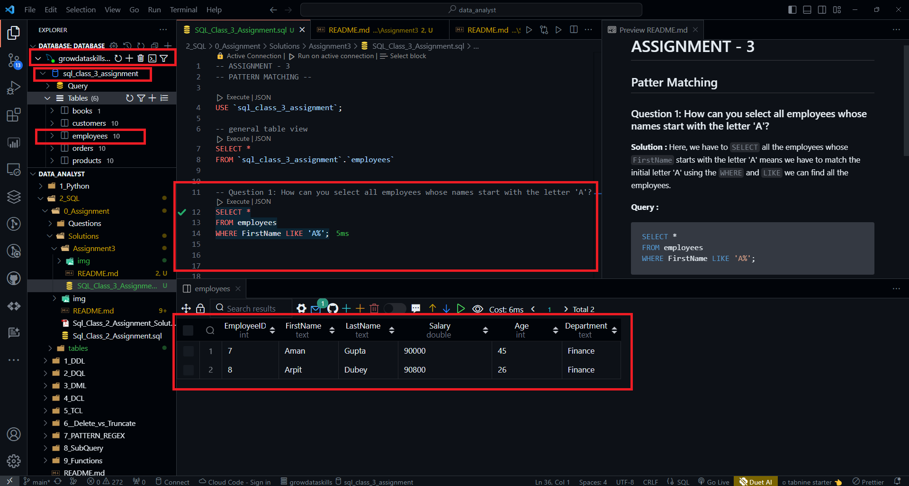
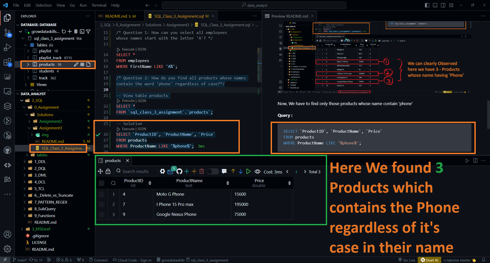
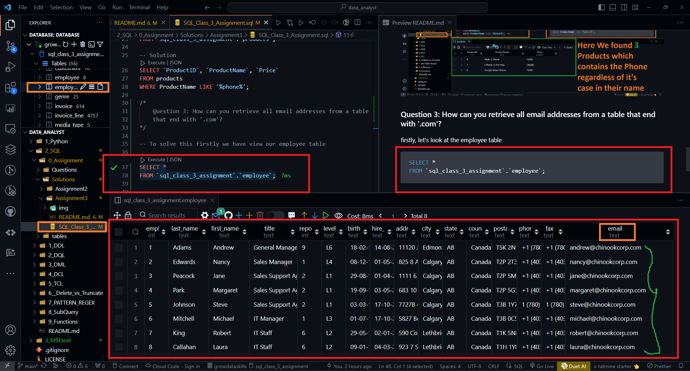
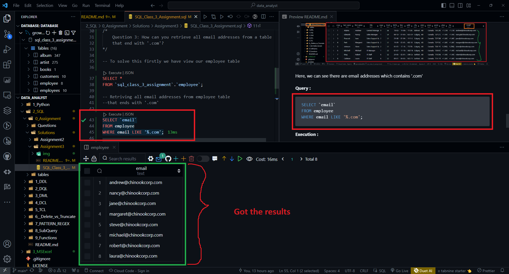
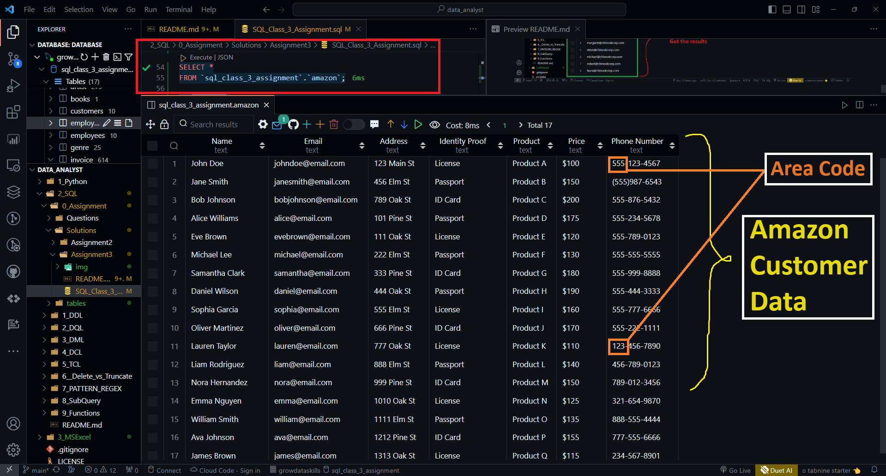
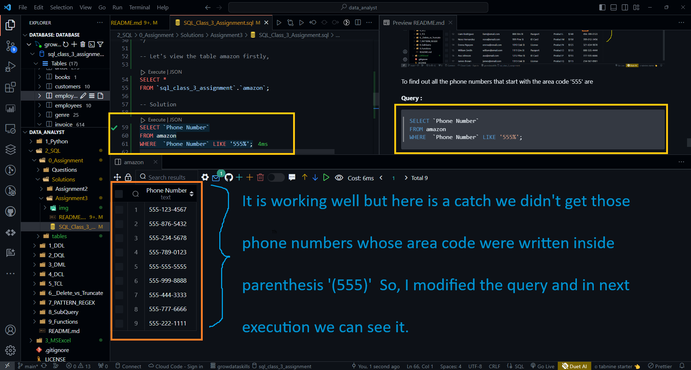
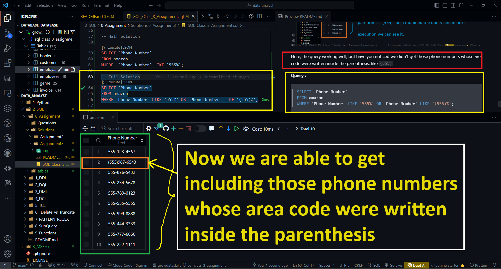
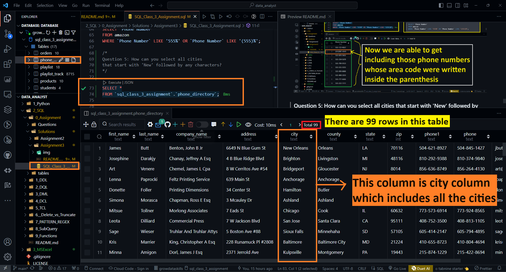
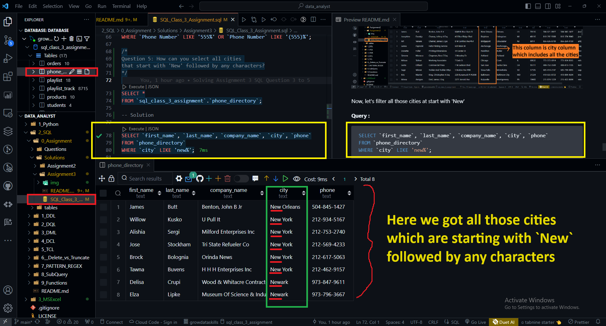

# ASSIGNMENT - 3

## Patter Matching

### Question 1: How can you select all employees whose names start with the letter 'A'?

**Solution :** Here, we have to `SELECT` all the employees whose `FirstName` starts with the letter 'A' means we have to match the initial letter 'A' using the `WHERE` and `LIKE` we can find all the employees.

**Query :**
```SQL
SELECT *
FROM employees
WHERE FirstName LIKE 'A%';
```

**Execution :**



### Question 2: How do you find all products whose names contain the word 'phone' regardless of case?

Let's first look at the product table 

**Query :**
```SQL
-- Query to view the list of products
SELECT *
FROM `sql_class_3_assignment`.`products`;
```
**Execution :**


Now, We have to find only those products whose name contain 'phone'

**Query :**

```SQL
SELECT `ProductID`, `ProductName`, `Price`
FROM products
WHERE ProductName LIKE '%phone%';
```

**Execution :**



### Question 3: How can you retrieve all email addresses from a table that end with '.com'?

firstly, let's look at the employee table 

**Query :**
```SQL
SELECT *
FROM `sql_class_3_assignment`.`employee`;
```
**Execution :**



Here, we can see there are email addresses which contains '.com'

**Query :**

```SQL
SELECT `email`
FROM employee
WHERE email LIKE '%.com';
```
**Execution :**



### Question 4: How do you find all phone numbers that start with the area code '555'?

**Query :**

```SQL
SELECT *
FROM `sql_class_3_assignment`.`amazon`;
```

**Execution :**



To find out all the phone numbers that start with the area code '555' are

**Query :**

```SQL
SELECT `Phone Number`
FROM amazon
WHERE  `Phone Number` LIKE '555%';
```
**Execution :**



Here, the query working well, but have you noticed we didn't get those phone numbers whose are code were written inside the parenthesis. like `(555)`

**Query :**

```SQL
SELECT `Phone Number`
FROM amazon
WHERE `Phone Number` LIKE '555%' OR `Phone Number` LIKE '(555)%';
```
**Execution :**



### Question 5: How can you select all cities that start with 'New' followed by any characters?

**Query :**

```SQL
SELECT *
FROM `sql_class_3_assignment`.`phone_directory`;
```
**Execution :**



Now, let's filter all those cities at start with 'New' 

**Query :**

```SQL
SELECT `first_name`, `last_name`, `company_name`, `city`, `phone`
FROM `phone_directory`
WHERE `city` LIKE 'new%';
```
**Execution :**

