## Q1. Create Database as SQL practice and use it for further questions.

- Creating a database name `Sql_Class_2_Assignment` and will use it for further questions.

#### Query: 
```SQL
CREATE DATABASE Sql_Class_2_Assignment;
```
#### Execution:


```SQL
USE Sql_Class_2_Assignment;
```


## Q2. Create a table named "Students" with the following columns: StudentID (int), FirstName (varchar), LastName (varchar), and Age (int). Insert at least three records into the table. 

- Creating a table named `Students` with the following columns: StudentID (int), FirstName (varchar), LastName (varchar), and Age (int)

#### Query:
```SQL
CREATE TABLE Students(
    StudentID INT,
    FirstName VARCHAR(60),
    LastName VARCHAR(60),
    Age INT
);
```
#### Execution:


- Inserting 3 random records into the table `Students`
#### Query:
```SQl
INSERT INTO Students(StudentID, FirstName, LastName, Age) 
VALUES (1, "Arpit", "Dubey", 25),
       (2, "Shaija", "Mishra", 23),
       (3, "Spider", "Man", 29);
```
#### Execution:

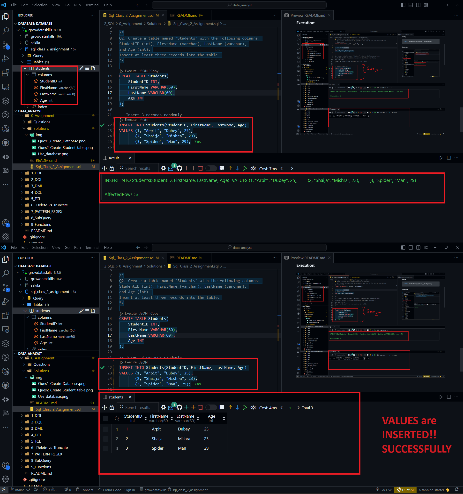


## Q3. Update the age of the student with StudentID `1` to `21`. Delete the student with StudentID `3` from the "Students" table.

- `UPDATE` the column `Age` of `students` table `WHERE` the `StudentID` is equal to `1`.

#### Query:

```SQl
UPDATE Students
SET Age = 21
WHERE StudentID = 1;
```
#### Execution:

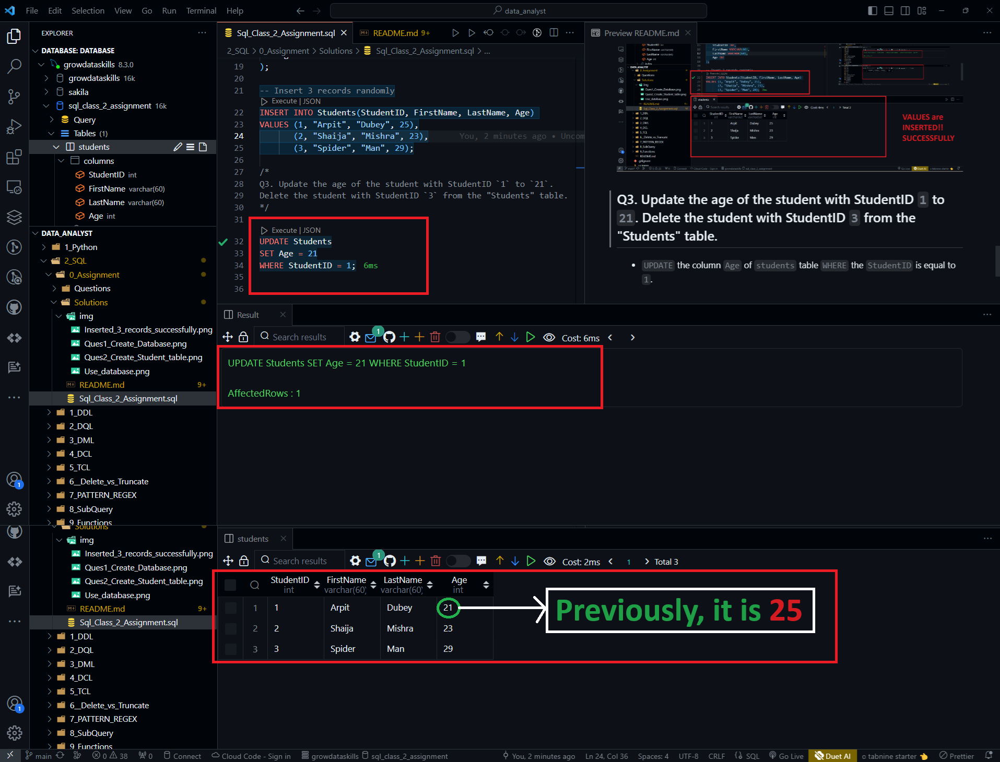

- `DELETE` the record of student `WHERE` the `StudentID` is `3`.

#### Query:

```SQL
DELETE FROM Students
WHERE StudentID = 3;
```
#### Execution:

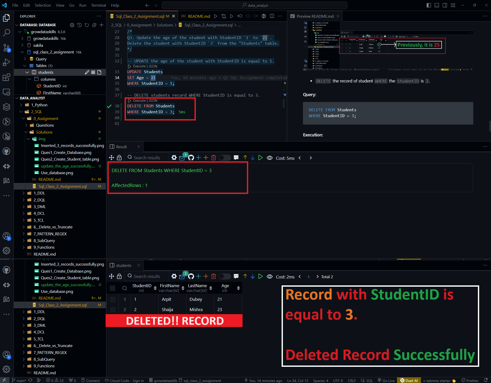

## Q4. Retrieve the first names and ages of all students who are older than 20.

- Retrieving the `FirstName` and `Age` of all students without any condition.

#### Query:

```SQl
SELECT FirstName, Age
FROM Students
```
#### Execution:

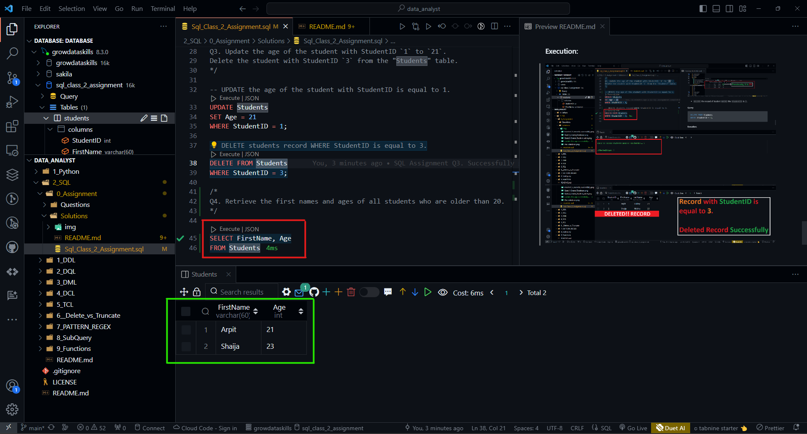

- Retrieving the `FirstName` and `Age` of all students `WHERE` the `Age` is greater than `20`..

#### Query:

```SQl
SELECT FirstName, Age
FROM Students
WHERE Age > 20;
```
#### Execution:

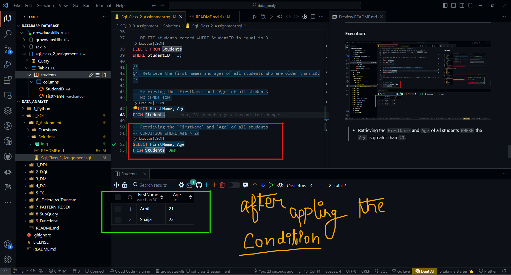

**NOTE : To Perform more operation we required more values so I just inserted more values to the table.**

#### Query:

```SQL
INSERT INTO Students(StudentID, FirstName, LastName, Age)
VALUES (4, "Rahul", "Kumar", 12),
       (5, 'Alice', 'Smith', 25),
       (6, 'Bob', 'Johnson', 15),
       (7, 'Eva', 'Martinez',16),
       (8, 'Hariharan', 'S', 26);
```

#### Execution:
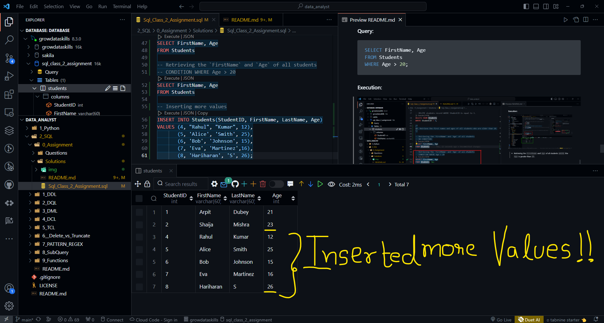

## Q5. Delete records from the same table where age < 18

- `DELETE` those records from the `Students` table `WHERE` the `Age` column `VALUES` are lesser than `18`

#### Query:

```SQL
DELETE FROM Students 
WHERE Age < 18;
```

#### Execution:

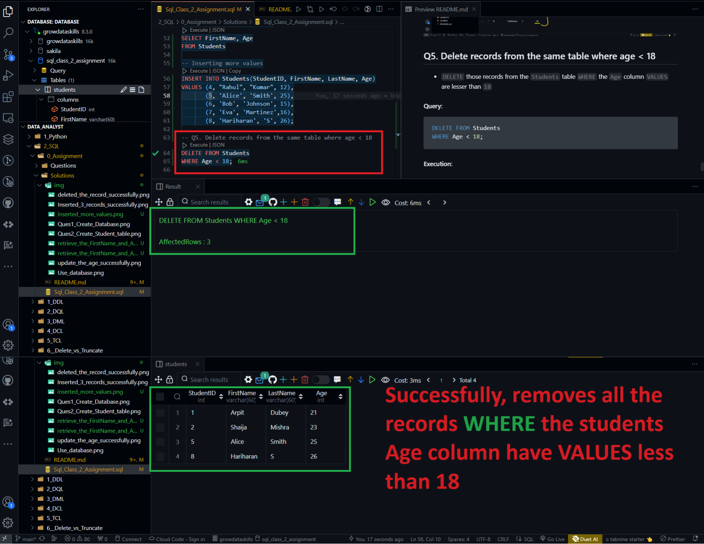

## Q6. Create a table named "Customers" with the following columns and constraints: CustomerID (int) as the primary key.FirstName (varchar) not null. LastName (varchar) not null. Email (varchar) unique. Age (int) check constraint to ensure age is greater than 18.

- `CREATE` a `TABLE` named it as `Customers`
- With columns such as `CustomerID`, `FirstName`, `LastName`, `Email` and, `Age`.
- `Age` columns must having a `CHECK` constraint where it ensures the `Age` will not be less than 18.

#### Query:

```SQL
CREATE TABLE Customers(
    CustomerID INT PRIMARY KEY,
    FirstName VARCHAR(60) NOT NULL,
    LastName VARCHAR(60) NOT NULL,
    Email VARCHAR(80) UNIQUE,
    Age INT CHECK (Age > 18)
);
```

#### Execution:

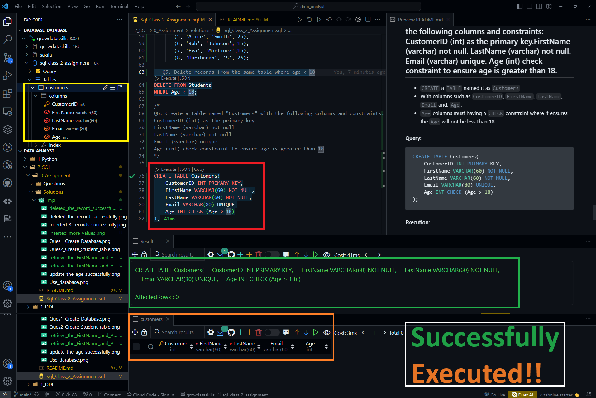


## Q7. You have a table named "Orders" with columns: OrderID (int), CustomerID (int), OrderDate (date), and TotalAmount (decimal). Create a foreign key constraint on the "CustomerID" column referencing the "Customers" table.

- Create Orders Table with Foreign Key Constraint: Now, create the "Orders" table while referencing the "Customers" table by including a foreign key constraint. Here's an example SQL script to create the "Orders" table with the foreign key constraint:

#### Query:

```SQL
CREATE TABLE Orders(
    OrderID INT,
    CustomerID INT,
    OrderDate DATE,
    TotalAmount DECIMAL(10,2),
    CONSTRAINT FK_CustomerID
    FOREIGN KEY (CustomerID) REFERENCES Customers(CustomerID)
);
```

**Introduction:** Provide an overview of the requirement to create the "Orders" table and to establish a relationship with the "Customers" table.

**Step 1:** Explain the creation of the "Customers" table with columns like CustomerID and CustomerName. Include the SQL script for creating the table.

**Step 2:** Describe the creation of the "Orders" table with columns like OrderID, CustomerID, OrderDate, and TotalAmount. Clarify the addition of a foreign key constraint on the "CustomerID" column, referencing the "CustomerID" column in the "Customers" table. Include the SQL script for creating the table along with the foreign key constraint.

```SQL
ALTER TABLE Orders
ADD CONSTRAINT FK_Customer
FOREIGN KEY (CustomerID)
REFERENCES Customers(CustomerID);
```

#### Execution:

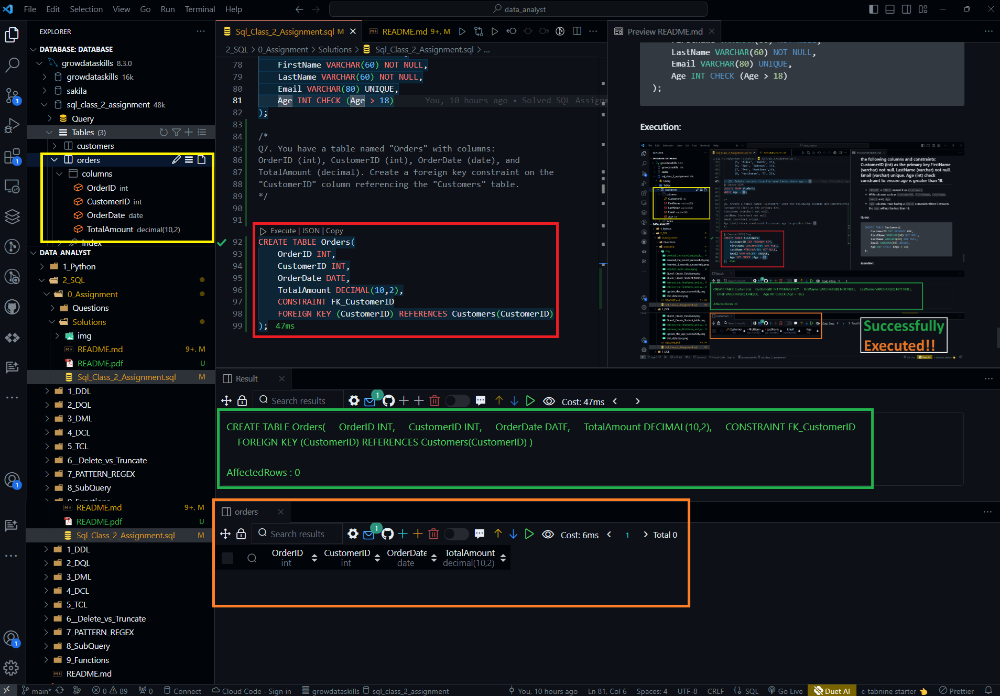

## Q8. Create a table named "Employees" with columns: EmployeeID (int) as the primary key. FirstName (varchar) not null. LastName (varchar) not null. Salary (decimal) check constraint to ensure salary is between 20000 and 100000.

- `CREATE` `TABLE` `Employees`: This line initiates the creation of the "`Employees`" table.

- (`EmployeeID` int `PRIMARY KEY`): Defines the "`EmployeeID`" column as an integer primary key.

- (`FirstName` varchar(80) `NOT NULL`): Specifies the "`FirstName`" column as a non-null varchar datatype.

- (`LastName` varchar(80) `NOT NULL`): Specifies the "`LastName`" column as a non-null varchar datatype.

- `Salary` `DECIMAL(10,2)` `CHECK` (`Salary` `BETWEEN` 20000 `and` 100000): `SET` the "`Salary`" column as a decimal type with a precision of 10 digits and 2 decimal places and adds a check constraint to ensure that the salary is between 20000 and 100000.

#### Query:

```SQl
CREATE TABLE Employees(
    EmployeeID INT PRIMARY KEY,
    FirstName VARCHAR(80) NOT NULL,
    LastName VARCHAR(80) NOT NULL,
    Salary DECIMAL(10,2) CHECK (Salary BETWEEN 20000 and 100000)
);
```

#### Execution:

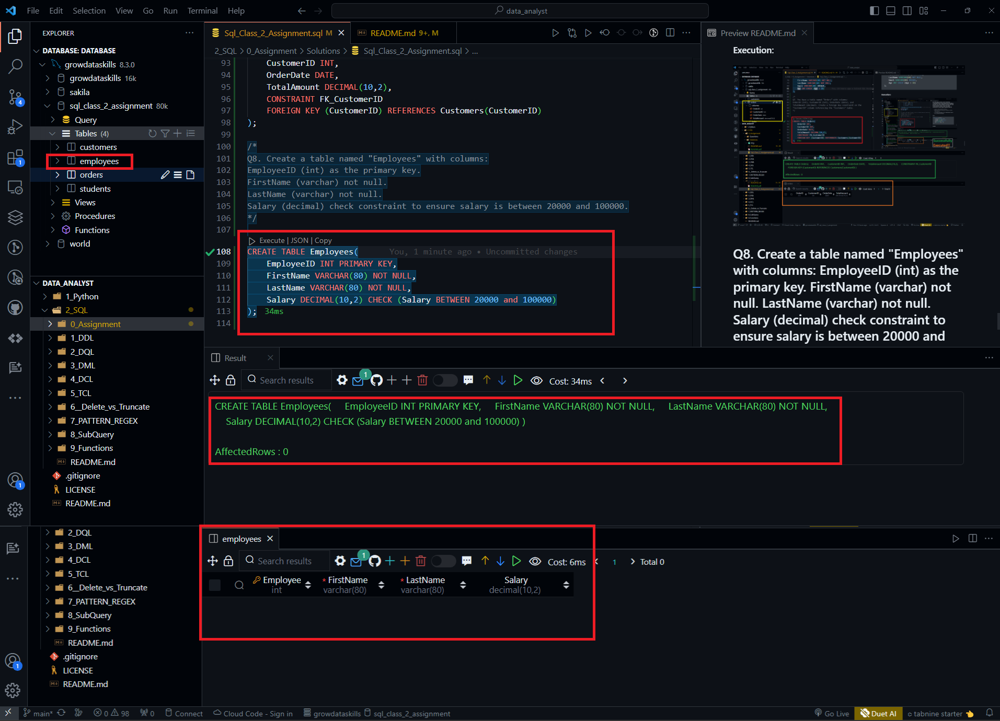

## Q9. Create a table named "Books" with columns: BookID (int) as the primary key. Title (varchar) not null. ISBN (varchar) unique.

- `CREATE TABLE Books`: Initiates the creation of a table named "`Books`" in the database.

- `(BookID INT PRIMARY KEY)`: Defines the "`BookID`" column as an integer primary key, ensuring its uniqueness and serving as the identifier for each book.

- `(Title VARCHAR(80) NOT NULL)`: Specifies the "`Title`" column as a non-null varchar data type, allowing up to 80 characters for the book title.

- `(ISBN VARCHAR(80) UNIQUE)`: Defines the "`ISBN`" column as a varchar data type with a maximum length of 80 characters, and adds a constraint to ensure that each `ISBN` value is unique.

#### Query:

```SQL
CREATE TABLE Books(
    BookID INT PRIMARY KEY,
    Title VARCHAR(80) NOT NULL,
    ISBN VARCHAR(80) UNIQUE
);
```
#### Execution:

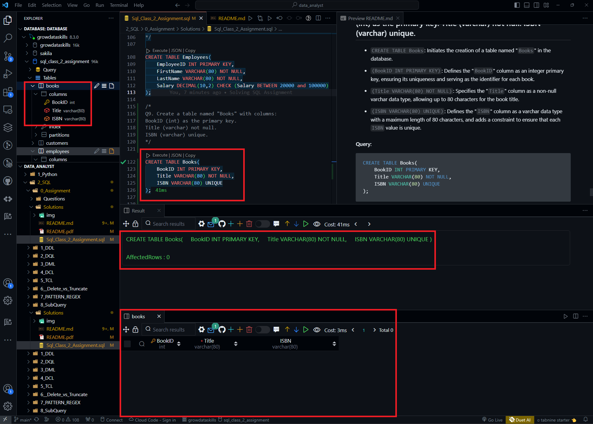

## Q10. Consider a table named "Employees" with columns: EmployeeID, FirstName, LastName, and Age. Write an SQL query to retrieve the first name and last name of employees who are older than 30

- Adding Age column to pre-exist Employees TABLE

#### Query:
```SQl
ALTER TABLE Employees
ADD Age INT;
```
#### Execution:

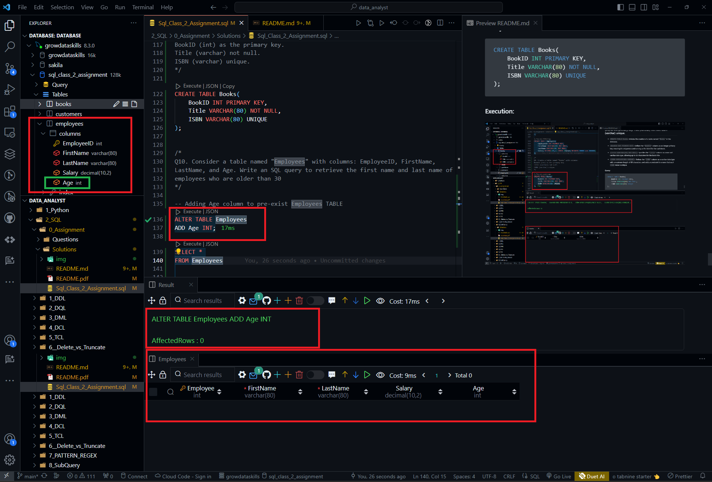

- Inserting some random values to Employees TABLE

#### Query:

```SQl
INSERT INTO Employees (EmployeeID, FirstName, LastName, Salary, Age) 
VALUES 
(1, 'Shivcharan', 'Das', 45000.00, 32),
(2, 'Krish', 'Naik', 60000.00, 35),
(3, 'Rohit', 'Kapoor', 75000.00, 42),
(4, 'Ekta', 'Dubey', 95000.00, 36),
(5, 'Shailja', 'Mishra', 80000.00, 23),
(6, 'Hariharan', 'S', 65000.00, 25),
(7, 'Aman', 'Gupta', 90000.00, 45),
(8, 'Arpit', 'Dubey', 90800.00, 26),
(9, 'Shreya', 'Richharia', 42000.00, 27),
(10, 'Sudhanshu', 'Kumar', 30000.00, 40);
```
#### Execution:

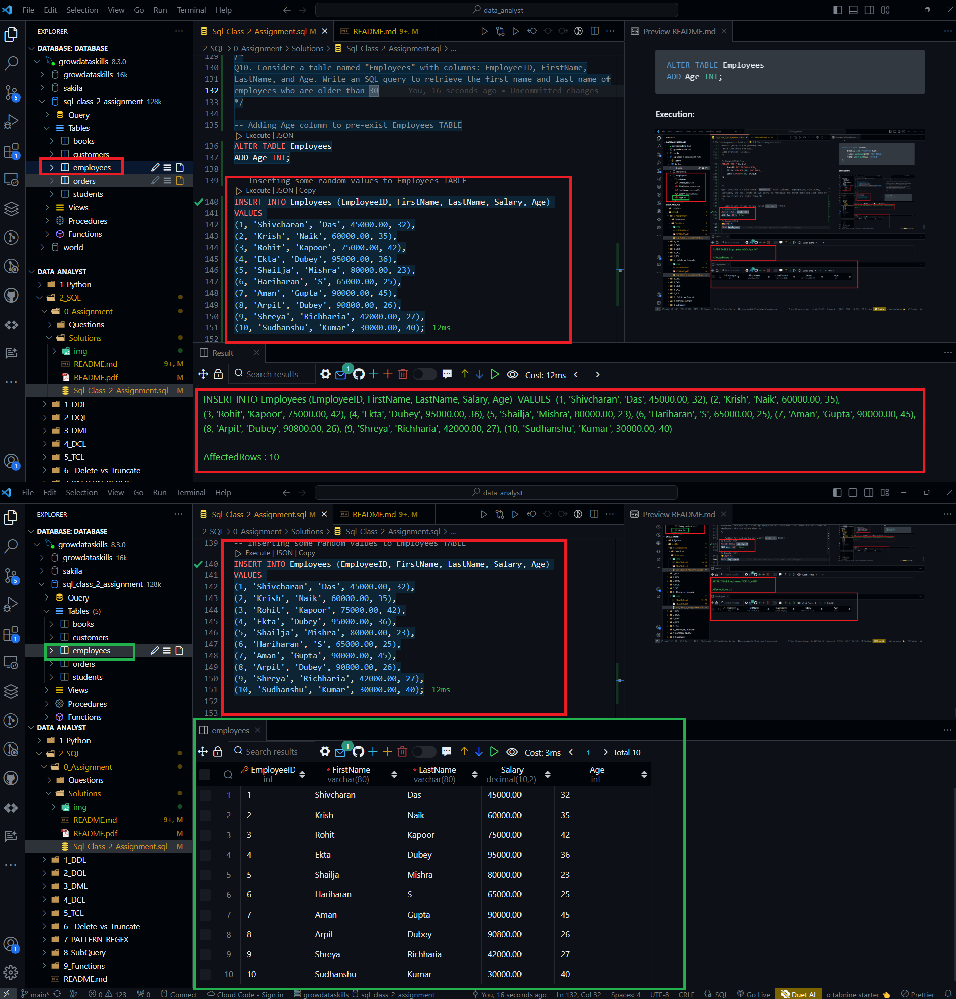

- SQL query to retrieve the first name and last name of employees who are older than 30

#### Query:

```SQL
SELECT FirstName, LastName
FROM Employees
WHERE Age > 30
```
#### Execution:

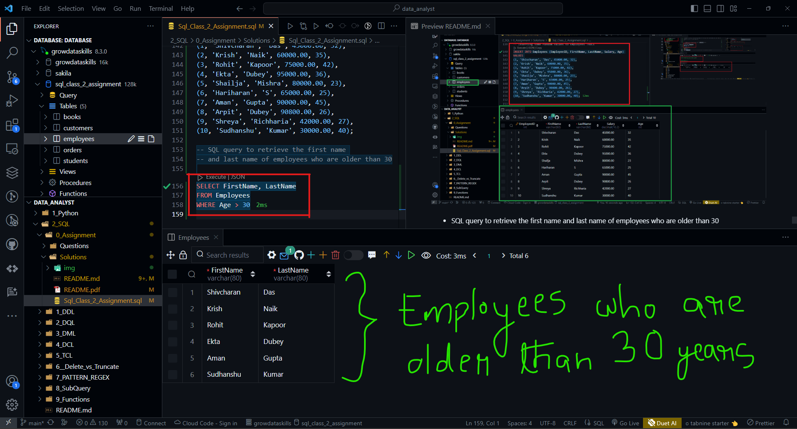

## Q11. Using the same "Employees" table, write an SQL query to retrieve the first name, last name, and age of employees whose age is between 20 and 30.

#### Query:

```SQL
SELECT FirstName, LastName, Age
FROM Employees
WHERE Age BETWEEN 20 and 30;
```

#### Execution:

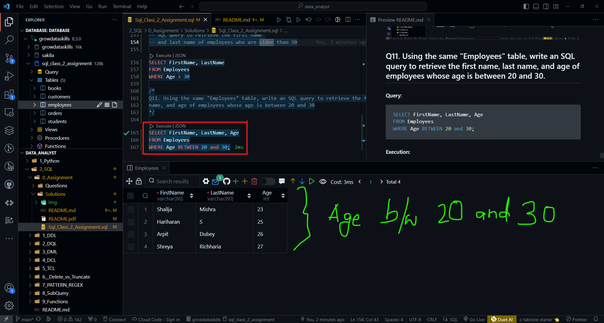

## Q12. Given a table named "Products" with columns: ProductID, ProductName, Price, and InStock (0- for out of stock, 1- for in stock). Write an SQL query to retrieve the product names and prices of products that are either priced above $100 or are out of stock

- Create a table named "Products"

#### Query:

```SQL
CREATE TABLE Products(
    ProductID INT,
    ProductName VARCHAR(80),
    Price DECIMAL(10, 2),
    InStock INT
);
```
#### Execution:

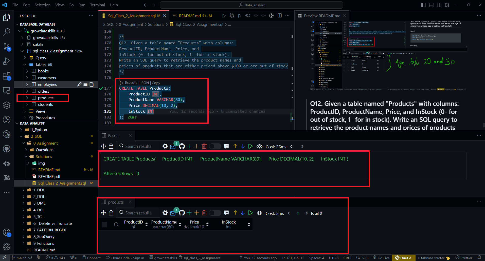

- Inserting some random values to the table

#### Query:

```SQl

INSERT INTO Products (ProductID, ProductName, Price, InStock) 
VALUES 
(1, 'Widget A', 120.00, 1),
(2, 'Gizmo X', 80.50, 0),
(3, 'Thingamajig', 150.00, 1),
(4, 'Doohickey', 90.00, 1),
(5, 'Whatchamacallit', 110.00, 0),
(6, 'Widget B', 95.00, 1),
(7, 'Gadget Y', 200.00, 0),
(8, 'Contraption Z', 180.00, 1),
(9, 'Doodad', 75.00, 0),
(10, 'Device Q', 105.00, 1);
```

#### Execution:

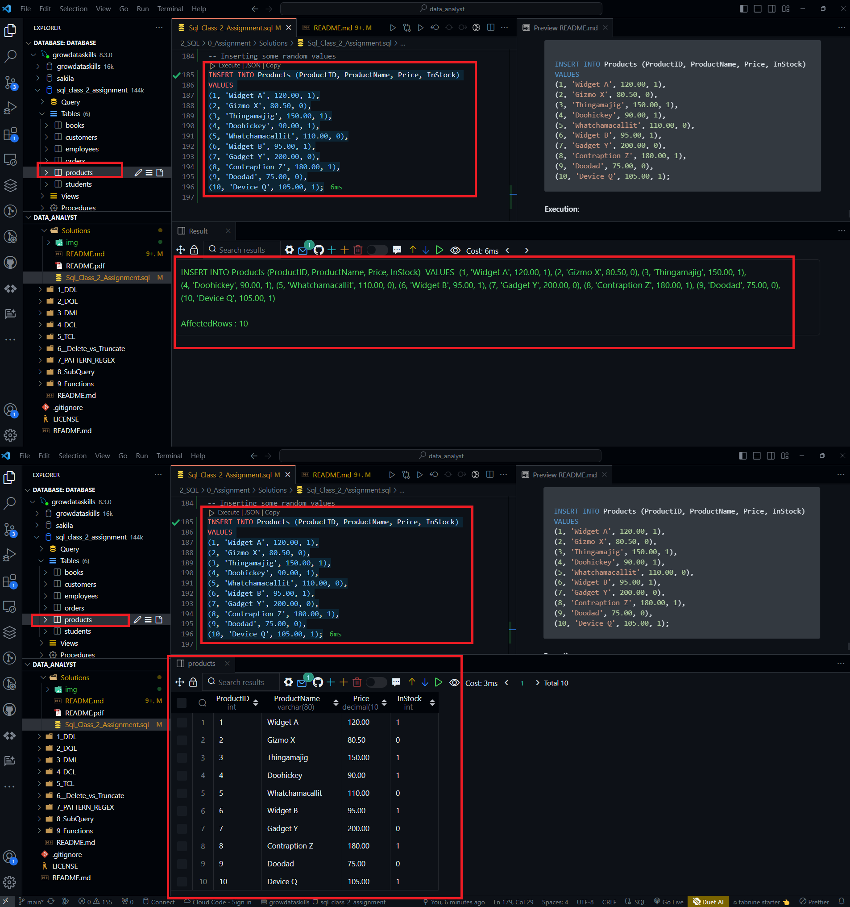

- SQL query to retrieve the product names and prices of products that are either priced above $100 or are out of stock

#### Query:

```SQL
SELECT ProductName, Price
FROM Products
WHERE Price > 100 OR InStock = 0;
```
#### Execution:

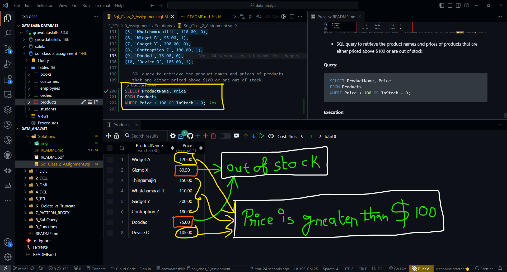

## Q13. Using the "Products" table, write an SQL query to retrieve the product names and prices of products that are in stock and priced between 50 and 150.

#### Query:

```SQL
SELECT ProductName, Price
FROM Products
WHERE InStock = 1 AND Price BETWEEN 50 AND 150;
```
#### Execution:

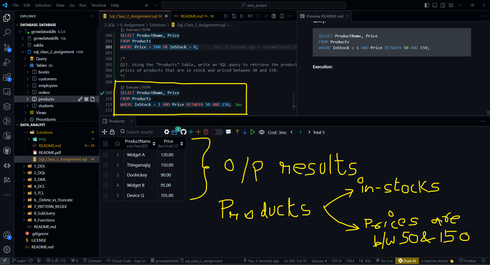

## Q14. Consider a table named "Orders" with columns:  OrderID, OrderDate, TotalAmount, and CustomerID. Write an SQL query to retrieve the order IDs and total amounts of orders placed by customer ID 1001 after January 1, 2023, or orders with a total amount exceeding $500

- Our `Customers` table is empty, so we have to put some values in that because our `Orders` table have a Foreign Key referencing to `Customers` table. 

#### Query:

```SQL
INSERT INTO Customers (CustomerID, FirstName, LastName, Email, Age) 
VALUES 
(1001, 'John', 'Doe', 'john.doe@example.com', 35),
(1002, 'Jane', 'Smith', 'jane.smith@example.com', 28),
(1003, 'Michael', 'Johnson', 'michael.johnson@example.com', 42),
(1004, 'Emily', 'Davis', 'emily.davis@example.com', 29),
(1005, 'Andrew', 'Wilson', 'andrew.wilson@example.com', 37),
(1006, 'Jessica', 'Brown', 'jessica.brown@example.com', 31),
(1007, 'William', 'Martinez', 'william.martinez@example.com', 45),
(1008, 'Olivia', 'Garcia', 'olivia.garcia@example.com', 26),
(1009, 'David', 'Anderson', 'david.anderson@example.com', 33),
(1010, 'Sophia', 'Lopez', 'sophia.lopez@example.com', 40);
```
#### Execution:

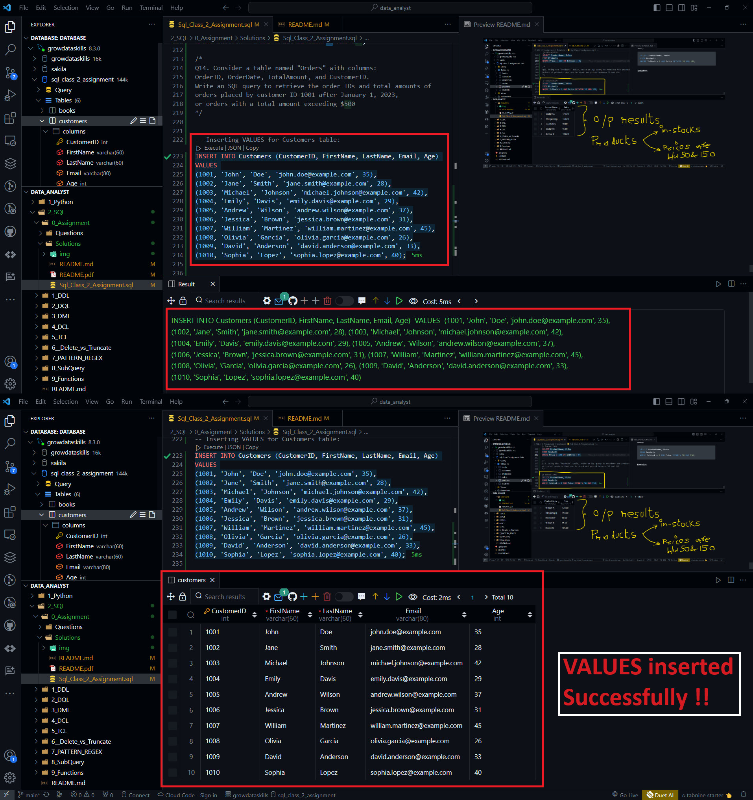

- Now, Inserting some random values in pre-created Orders TABLE

```SQL
(1,  1001, '2023-01-15', 450.00),
(2,  1002, '2023-02-20', 700.00),
(3,  1003, '2023-01-05', 300.00),
(4,  1001, '2023-03-10', 800.00),
(5,  1001, '2023-02-28', 550.00),
(6,  1004, '2023-01-20', 480.00),
(7,  1001, '2023-02-10', 650.00),
(8,  1001, '2023-04-05', 350.00),
(9,  1005, '2023-03-15', 900.00),
(10, 1001, '2023-01-25', 750.00);

```
#### Execution:

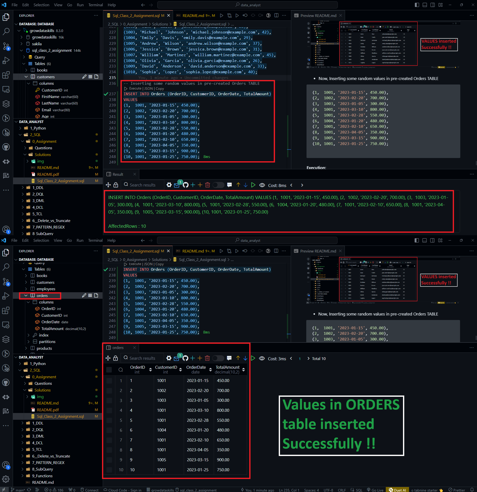

- SQL query to retrieve the order IDs and total amounts of orders placed by customer ID 1001 after January 1, 2023, or orders with a total amount exceeding $500

#### Query:

```SQL
SELECT OrderID, TotalAmount
FROM Orders
WHERE (CustomerID = 1001 AND OrderDate > '2023-01-01') 
OR TotalAmount > 500;
```

#### Execution:
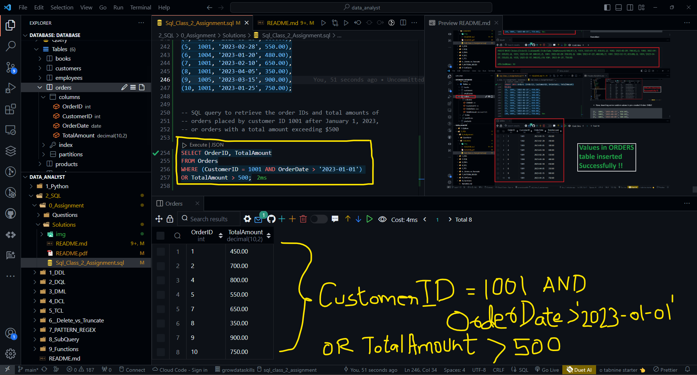

## Q15. Retrieve the ProductName of products from the "Products" table that have a price between $50 and $100.

#### Query:

```SQL
SELECT ProductName
FROM Products
WHERE Price BETWEEN 50 AND 100;
```

#### Execution:

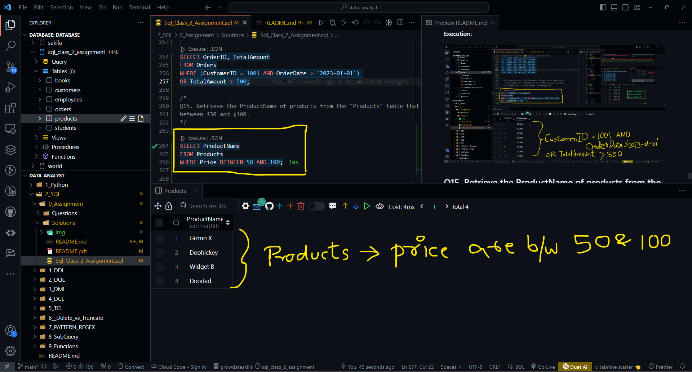