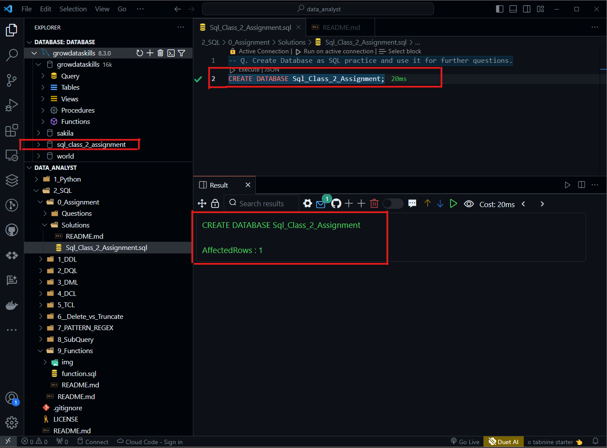
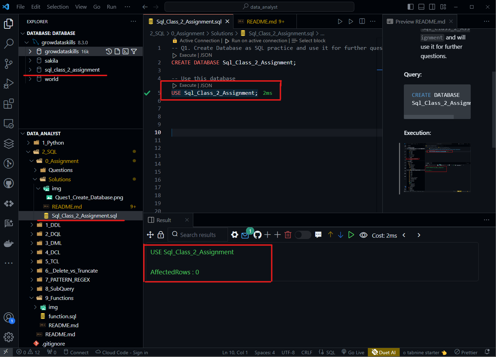
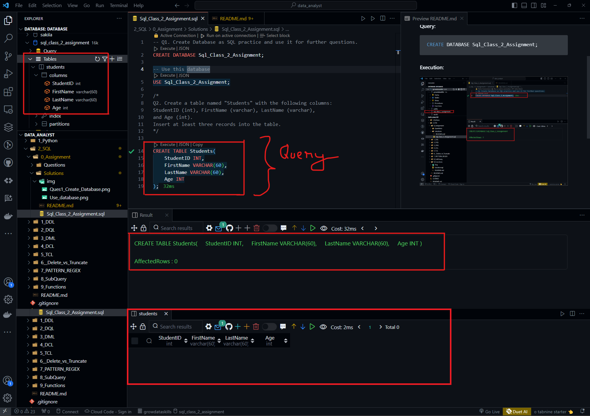

## Q1. Create Database as SQL practice and use it for further questions.

- Creating a database name `Sql_Class_2_Assignment` and will use it for further questions.

#### Query: 
```SQL
CREATE DATABASE Sql_Class_2_Assignment;
```
#### Execution:


```SQL
USE Sql_Class_2_Assignment;
```



## Q2. Create a table named "Students" with the following columns: StudentID (int), FirstName (varchar), LastName (varchar), and Age (int). Insert at least three records into the table. 

- Creating a table named `Students` with the following columns: StudentID (int), FirstName (varchar), LastName (varchar), and Age (int)

#### Query:
```SQL
CREATE TABLE Students(
    StudentID INT,
    FirstName VARCHAR(60),
    LastName VARCHAR(60),
    Age INT
);
```
#### Execution:

