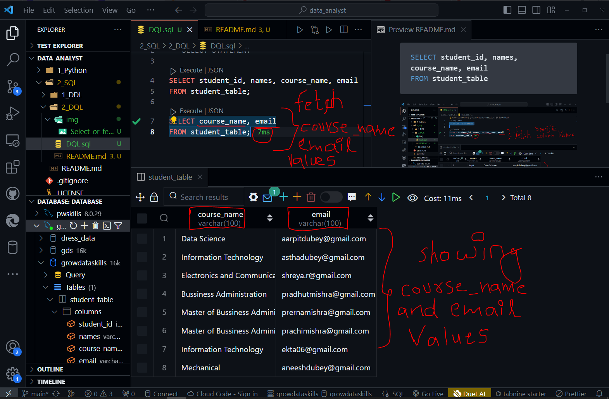

To fetch or select specific columns from table we can use the below query

```SQL
SELECT student_id, names, course_name, email
FROM student_table
```


Below is another example to slect only 'course_name' and 'email' we can use:

```SQl
SELECT student_id, names
FROM student_table;
```



To select of fetch out all columns values (Suppose their are 100 columns so it is not feasible to write specific column names for this we use '*')

```SQL
SELECT *
FROM student_table;
```

_fetch_values.png)

