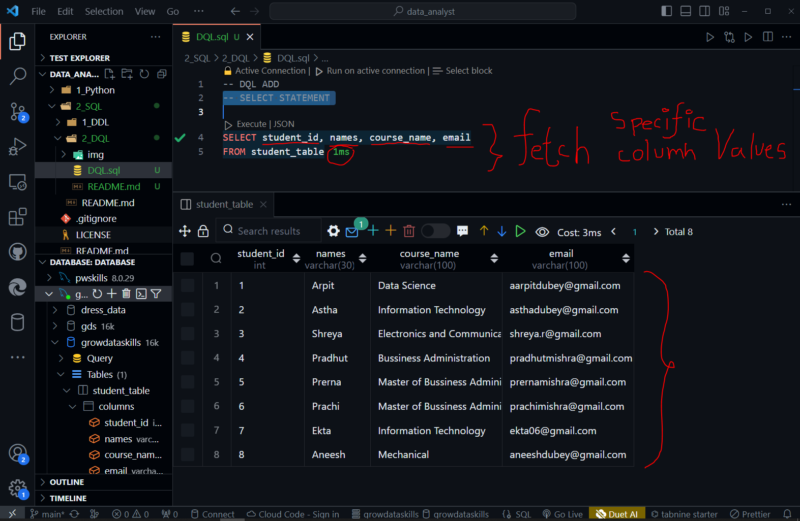

To fetch or select specific columns from table we can use the below query

```SQL
SELECT student_id, names, course_name, email
FROM student_table
```


Below is another example to slect only 'course_name' and 'email' we can use:

```SQl
SELECT student_id, names
FROM student_table;
```


To select of fetch out all columns values (Suppose their are 100 columns so it is not feasible to write specific column names for this we use '*')

```SQL
SELECT *
FROM student_table;
```

_fetch_values.png)

In SQL, setting SQL_SAFE_UPDATE = 0; disables the safety feature that requires a WHERE condition to be used in UPDATE and DELETE statements. 

- By default, when SQL_SAFE_UPDATE is set to 1, it helps prevent accidental data updates or deletions by requiring the use of a WHERE clause to specify which records are to be updated or deleted. 

- When set to 0, this safety feature is turned off, allowing updates and deletions without the WHERE clause, which can be risky if not used carefully.

```SQL
SET SQL_SAFE_UPDATES = 0;
```


- After turnning off the security measures we can update and set the values to another one.

```SQL
UPDATE student_table 
SET email = 'shreya201@gmail.com'
WHERE names = 'Shreya';
```


