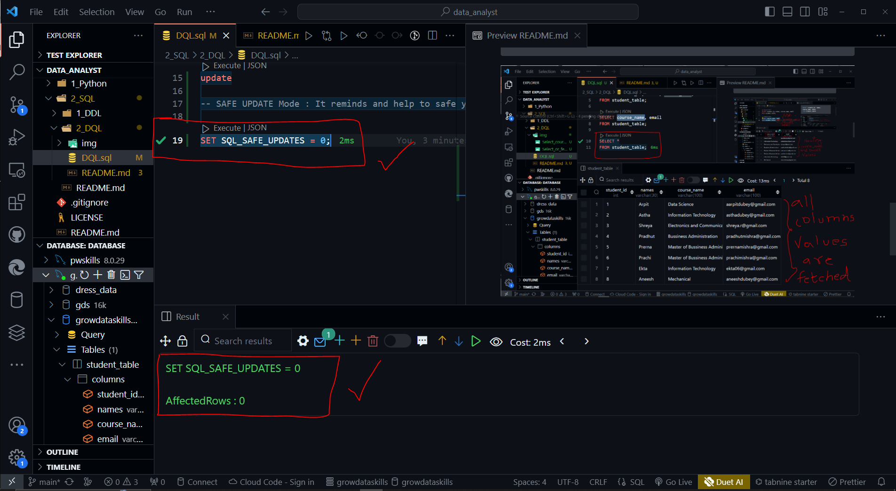
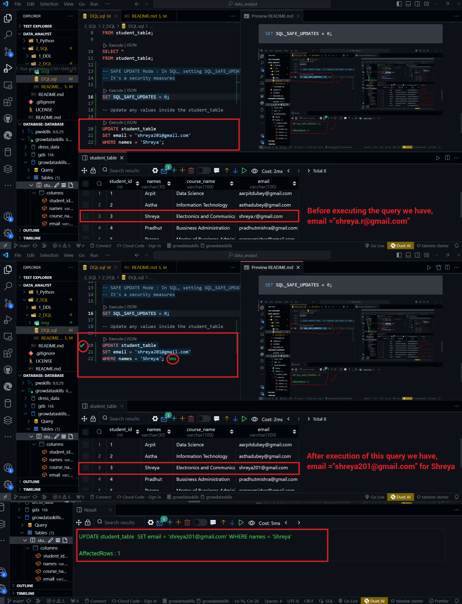
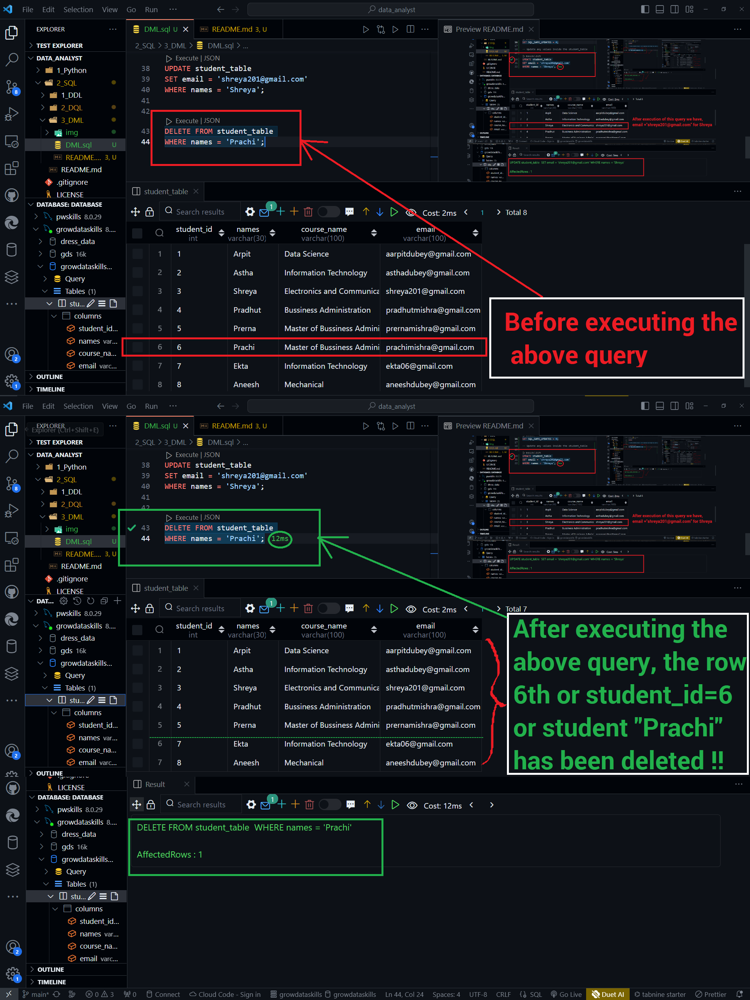
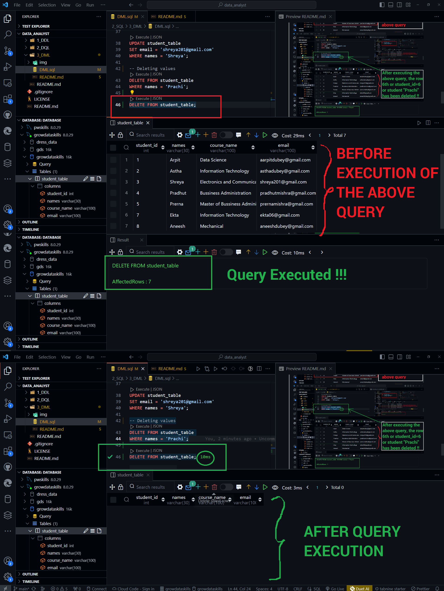

# DML commands

In SQL, setting SQL_SAFE_UPDATE = 0; disables the safety feature that requires a WHERE condition to be used in UPDATE and DELETE statements. 

- By default, when SQL_SAFE_UPDATE is set to 1, it helps prevent accidental data updates or deletions by requiring the use of a WHERE clause to specify which records are to be updated or deleted. 

- When set to 0, this safety feature is turned off, allowing updates and deletions without the WHERE clause, which can be risky if not used carefully.

```SQL
SET SQL_SAFE_UPDATES = 0;
```



- After turnning off the security measures we can update and set the values to another one.

```SQL
UPDATE student_table 
SET email = 'shreya201@gmail.com'
WHERE names = 'Shreya';
```



DELETE is used to delete records from the database
table or table itself.

```SQL
DELETE FROM student_table 
WHERE names = 'Prachi';
```



```SQL
DELETE FROM student_table;
```




<center> DML Done </center>
