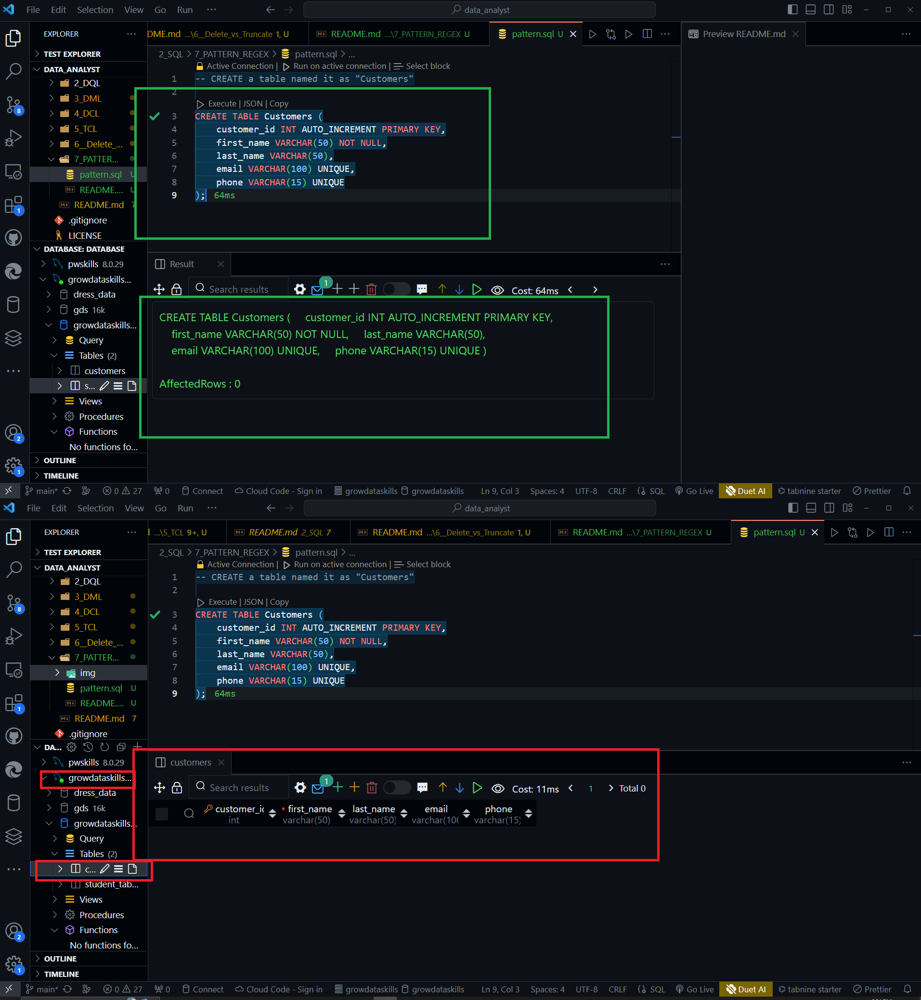
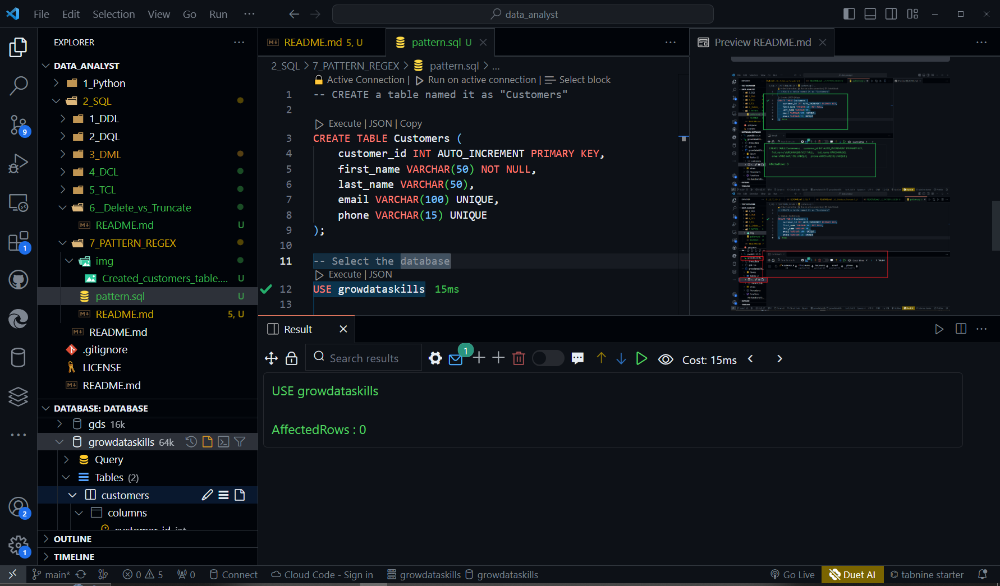
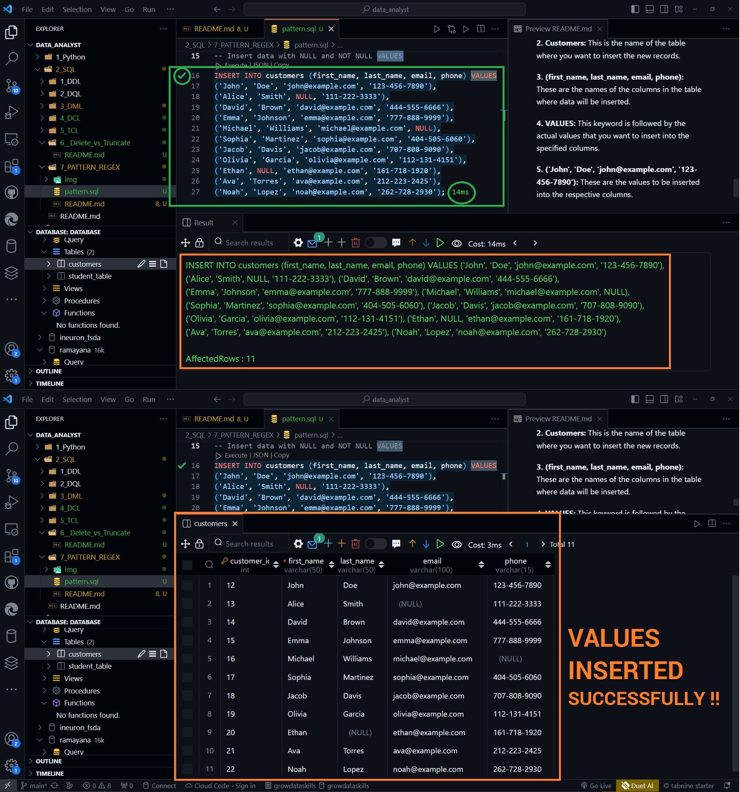
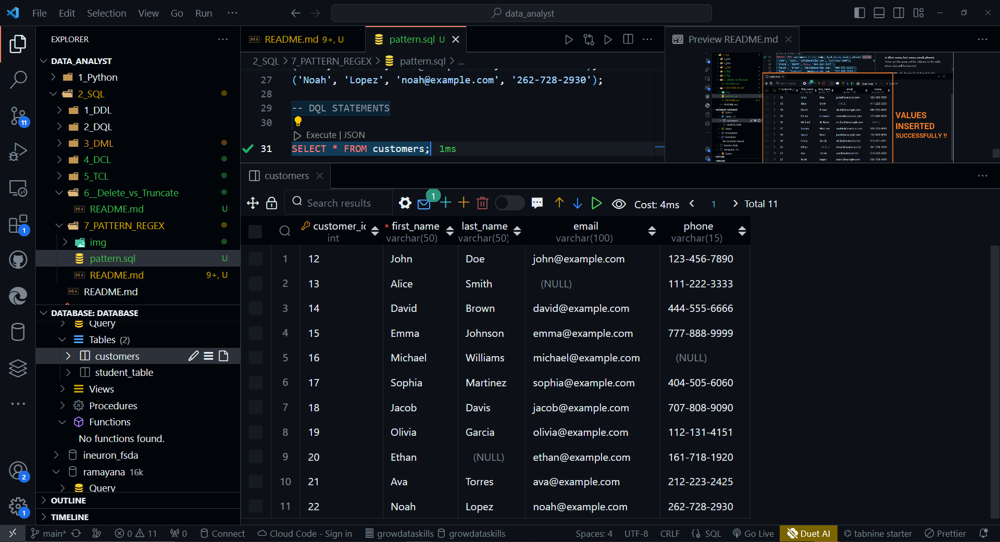

# PATTERNS or REGEX in SQL

We are going to creates a table named "**Customers**" with the following structure:

**1. customer_id:** An integer field that automatically increments for each new record. It is set as the primary key, meaning each value in this column must be unique and not null.

**2. first_name:** A string field with a maximum length of 50 characters that cannot be null.

**3. last_name:** A string field with a maximum length of 50 characters. Null values are allowed.

**4. email:** A string field with a maximum length of 100 characters, and each value in this field must be unique. It's likely intended to store email addresses.

**5. phone:** A string field with a maximum length of 15 characters, and each value in this field must be unique. It's likely intended to store phone numbers.

### 1. CREATE TABLE Customers:

```SQL
CREATE TABLE Customers (
    customer_id INT AUTO_INCREMENT PRIMARY KEY,
    first_name VARCHAR(50) NOT NULL,
    last_name VARCHAR(50),
    email VARCHAR(100) UNIQUE,
    phone VARCHAR(15) UNIQUE
);
```



### 2. Select (USE) the DATABASE

- To select the database associated with this table we use SQL command

```SQL
USE growdataskills;
```


### 3. INSERT some records in the TABLE
- The INSERT SQL command is used to add new records (rows) to a database table.

```SQL
INSERT INTO Customers (first_name, last_name, email, phone) VALUES
('John', 'Doe', 'john@example.com', '123-456-7890'),
('Alice', 'Smith', NULL, '111-222-3333'),
('David', 'Brown', 'david@example.com', '444-555-6666'),
('Emma', 'Johnson', 'emma@example.com', '777-888-9999'),
('Michael', 'Williams', 'michael@example.com', NULL),
('Sophia', 'Martinez', 'sophia@example.com', '404-505-6060'),
('Jacob', 'Davis', 'jacob@example.com', '707-808-9090'),
('Olivia', 'Garcia', 'olivia@example.com', '112-131-4151'),
('Ethan', NULL, 'ethan@example.com', '161-718-1920'),
('Ava', 'Torres', 'ava@example.com', '212-223-2425'),
('Noah', 'Lopez', 'noah@example.com', '262-728-2930');
```

**1. INSERT INTO:** This specifies that you want to add new records into a table.

**2. Customers:** This is the name of the table where you want to insert the new records.

**3. (first_name, last_name, email, phone):** These are the names of the columns in the table where data will be inserted.

**4. VALUES:** This keyword is followed by the actual values that you want to insert into the specified columns.

**5. ('John', 'Doe', 'john@example.com', '123-456-7890'):** These are the values to be inserted into the respective columns.





### DQL - SELECT (*, specific_columns)

**1. * (Asterisk) or ALL**

```SQL
SELECT * FROM Customers;
```



**2. Specific columns**

```SQL

```

