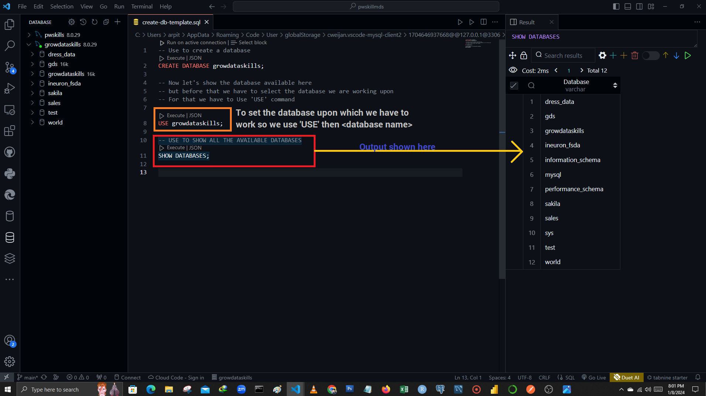

**Data :** Data refers to distinct pieces of information (or) numbers, words, measurements, observations, facts, figures, audio, video etc.,

**Database :** It is like a digital filing cabinet where data is stored in organized (or) procedural manner, data might be structured (or) unstructured.
<br><br>Unstructured data refers to information that doesn't fit neatly into traditional row-and-column (or) database structures, such as text documents, images, videos, and social media posts such as Instagram database stores user profiles and comments (structured data), it also stores photos and videos (unstructured data), making it easy for users to access and share them.

### Database Management System

- A Database Management System (DBMS) is basically a software where you can store, retrieve, define, and manage your data in a database.

1. MySQL
2. Oracle
3. Microsoft SQL 
4. PostgreSQL
5. MongoDB

## Advantages of Database Management System

- DBMS has lots of techniques to store, manipulate, and retrieve data.

- DBMS considered as an most efficient handler to balance the data.

- A DBMS uses lots of powerful functions to store, manipulate and retrieve data efficiently.

- Data Integrity and Security is one of the most strong part of DBMS

- DBMS use data integrity to protect data and maintains the privacy.

- Helps to reduce Application Development Time.

**RDBMS** : A Relational database management system (RDBMS) is used for database management.

- Data in RDBMS is store in database objects called table. A table is a collection of related data entries, and it consists of rows and columns.

- A record, also called a row in each individual entry that exists in the table.

- A column is a vertical entity in a table that conatins all the information associated with a specific field in a table.

#### What is SQL?

- SQL stands for Structured Query Language.

- SQL lets you access and manipulate databases.

- SQL become a standard of the American National Standards Institute (ANSI) in 1986, and of the International Organization for Standardization (ISO) in 1987.

TYPES OF COMMANDS:
1. DDL 
    - CREATE 
    - ALTER
    - DROP
    - TRUNCATE
    - RENAME
2. DML
    - INSERT
    - UPDATE
    - DELETE
3. DQL
    - SELECT
4. DCL
    - GRANT
    - REVOKE
5. TCL
    - ROLLBACK
    - COMMIT
    - SAVEPOINT


# DDL commands:

1. Command to create a database:

```SQL
CREATE DATABASE <database_name>;

-- Let's create a database named it as 'growdataskills'
CREATE DATABASE growdataskills;
```


2.  Show all the available databases

```SQL
-- Before Show databases we have to select the database we are working upon.
-- So, for this we have to use 'USE' command.
USE growdataskills;

-- Show databases
SHOW DATABASES;
```



3. To use the database

```SQl
USE <database name>;

-- Example
USE growdataskills;
```


4. To see which database is in used or which database has been surrently selected

```SQl
SELECT database();
```
.png)
