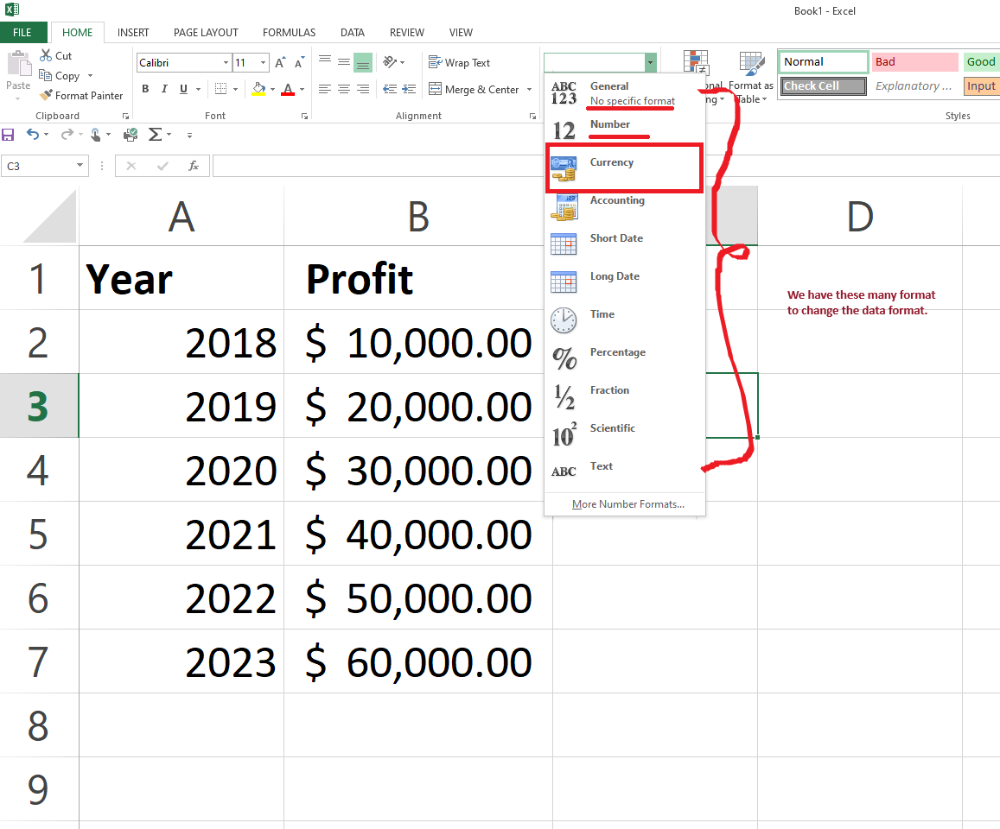

### Auto-filling Feature:

The auto-fill feature in Microsoft Excel is a powerful tool that allows users to quickly and easily populate cells with a series of data.

- Useful when dealing with sequences or patterns, such as numerical or chronological data.

- Auto-fill can save time 

When using the auto-fill feature to populate a series of years in Excel, such as from 2018 to 2023, users can follow these steps:

1. Begin by entering the starting value in the first cell, in this case 2018.
2.  Then, enter 2019 in the second-botton cell and select both the cells using `Shift` key from keyboard then, move the cursor to the bottom-right corner of the cell containing the value 2019. The cursor should change to a small black cross, indicating the fill handle.

3. Click and drag the fill handle down to the desired end value, in this case 2023. As you drag, Excel will automatically populate the cells with the sequential years.

### Number Formats (or) Data Types Conversion Features

- You use number format to change the format of the data provided.

- Here, we use Auto-filling feature in Profit column and then use the Number Formatting section to use the feature.

- Using the feature we change the Profit data into currency format as shown below:

### Removing Decimal Values from profit column data.

- You can use the same Number Format Feature to remove the decimal from the data.

- You can also add `%` (percentage) sign etc., to format the numerical data.

